# Informe del Trabajo Final

  

  
<b>Informe de Trabajo Final</b>

  
Facultad de Ingeniería

  
Universidad Peruana de Ciencias Aplicadas

  
Ingeniería de Software

  
Aplicaciones Web - 1ASI0730

  
NRC: 7414

  
Alex Humberto Sánchez Ponce

  
Startup: NeuroDraw

  
Producto: NeuroZen

---

## Team members:

| **Nombre**                         | **Código** |
| ---------------------------------- | ---------- |
| Manuel Fernando, Joao Castro Picón | U20231G159 |
| Solis Chang, Santiago Valentino    | U20231B475 |
| Vila Guillen, Miguel Angel         | U20231G054 |
| Requena Gutiérrez, Diego Gabriel   | U202321774 |
| Abud Angulo, Juan Carlos           | U202317692 |

  
<b>Ciclo 2025 - 20</b>

---

## Registro de Versiones del Informe

El objetivo de esta sección es resumir las modificaciones relevantes que se realizan al informe durante el ciclo de vida del proyecto.

| Versión | Fecha      | Autor                        | Descripción de modificación                                                                       |
| ------- | ---------- | ---------------------------- | ------------------------------------------------------------------------------------------------- |
| 1.0     | 2025-09-10 | Manuel Castro                | Creación inicial del documento: carátula, índice preliminar y Student Outcome (TB1).              |
| 1.1     | 2025-09-12 | Diego Requena                | Se añadió Introducción: Startup Profile y Solution Profile (antecedentes, problemática, Lean UX). |
| 1.2     | 2025-09-14 | Santiago Solis               | Se incorporó Segmentos Objetivos y análisis competitivo de competidores (Calm, Wysa, Equoo).      |
| 1.3     | 2025-09-16 | Miguel Vila                  | Se agregó diseño y registro de entrevistas (segmentos 1 y 2) con sus respectivos resúmenes.       |
| 1.4     | 2025-09-17 | Manuel Castro                | Inclusión de Needfinding: User Personas, Journey Mapping y Empathy Map.                           |
| 1.5     | 2025-09-18 | Equipo completo              | Desarrollo de User Stories con Epics, criterios de aceptación y armado del Product Backlog.       |
| 1.6     | 2025-09-19 | Juan Angulo & Diego Requena  | Se documentó el Big Picture Event Storming con capturas y explicación del proceso.                |
| 1.7     | 2025-09-20 | Miguel Vila & Santiago Solis | Se añadió Style Guidelines (tipografía, colores, íconos) y primeras secciones de Product Design.  |

## Project Report Collaboration Insights

El equipo ha trabajado de manera colaborativa en el repositorio de GitHub, registrando avances constantes en la construcción del informe.
Repositorio del informe: 

A continuación, se presentan las evidencias de participación y colaboración de los integrantes:

- Cada integrante del grupo realizó commits, modificaciones y carga de archivos en distintas secciones del informe.
- Se refleja la división de tareas entre redacción, correcciones de estilo, incorporación de imágenes y ajustes técnicos en Markdown.
- Todos los miembros participaron en mayor o menor medida, garantizando que el documento evolucionara de forma colaborativa y transparente.
- La evidencia gráfica incluye la vista de contribuciones, así como el historial de actividad donde se observa el detalle de commits y cambios en el repositorio.

### Contribuciones por integrante

  
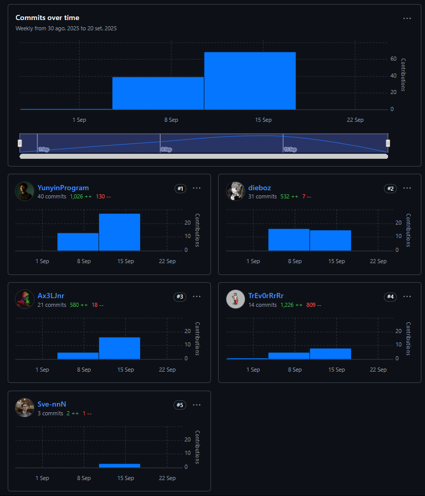

En esta vista se observa la cantidad de commits realizados, junto con el balance de líneas añadidas y eliminadas.

### Historial de actividad del repositorio

  
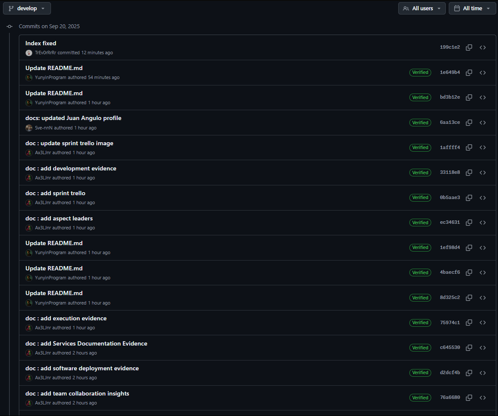

  
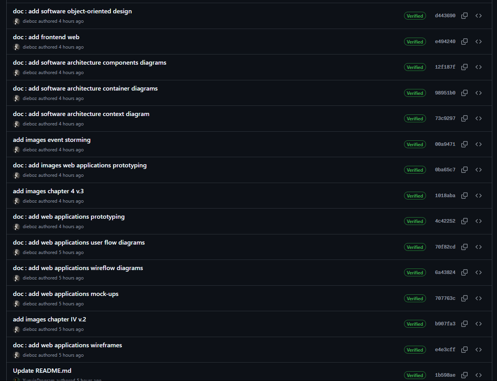

En conjunto, las capturas reflejan el cumplimiento de los objetivos de colaboración: participación activa de todos los integrantes, registro claro de los aportes, y una evolución continua y transparente del informe del proyecto.

# Contenido

1. **[Capítulo I: Introducción](#1-capítulo-i-introducción)**  
   &nbsp;&nbsp;&nbsp;&nbsp;1.1. [Startup Profile](#11-startup-profile)  
   &nbsp;&nbsp;&nbsp;&nbsp;&nbsp;&nbsp;&nbsp;&nbsp;1.1.1. [Descripción del startup](#111-descripción-del-startup)  
   &nbsp;&nbsp;&nbsp;&nbsp;&nbsp;&nbsp;&nbsp;&nbsp;1.1.2. [Perfiles de los integrantes del equipo](#112-perfiles-de-los-integrantes-del-equipo)  
   &nbsp;&nbsp;&nbsp;&nbsp;1.2. [Solution Profile](#12-solution-profile)  
   &nbsp;&nbsp;&nbsp;&nbsp;&nbsp;&nbsp;&nbsp;&nbsp;1.2.1. [Antecedentes y Problemática](#121-antecedentes-y-problemática)  
   &nbsp;&nbsp;&nbsp;&nbsp;&nbsp;&nbsp;&nbsp;&nbsp;1.2.2. [Lean UX Process](#122-lean-ux-process)  
   &nbsp;&nbsp;&nbsp;&nbsp;&nbsp;&nbsp;&nbsp;&nbsp;&nbsp;&nbsp;&nbsp;&nbsp;1.2.2.1. [Lean UX Problem Statement](#1221-lean-ux-problem-statement)  
   &nbsp;&nbsp;&nbsp;&nbsp;&nbsp;&nbsp;&nbsp;&nbsp;&nbsp;&nbsp;&nbsp;&nbsp;1.2.2.2. [Lean UX Assumptions](#1222-lean-ux-assumptions)  
   &nbsp;&nbsp;&nbsp;&nbsp;&nbsp;&nbsp;&nbsp;&nbsp;&nbsp;&nbsp;&nbsp;&nbsp;1.2.2.3. [Lean UX Hypothesis Statements](#1223-lean-ux-hypothesis-statements)  
   &nbsp;&nbsp;&nbsp;&nbsp;&nbsp;&nbsp;&nbsp;&nbsp;&nbsp;&nbsp;&nbsp;&nbsp;1.2.2.4. [Lean UX Canvas](#1224-lean-ux-canvas)  
   &nbsp;&nbsp;&nbsp;&nbsp;1.3. [Segmentos objetivos](#13-segmentos-objetivos)

2. **[Capítulo II: Requirements Elicitation & Analysis](#2-capítulo-ii-requirements-elicitation--analysis)**  
   &nbsp;&nbsp;&nbsp;&nbsp;2.1. [Competidores](#21-competidores)  
   &nbsp;&nbsp;&nbsp;&nbsp;&nbsp;&nbsp;&nbsp;&nbsp;2.1.1. [Análisis competitivo](#211-análisis-competitivo)  
   &nbsp;&nbsp;&nbsp;&nbsp;&nbsp;&nbsp;&nbsp;&nbsp;2.1.2. [Estrategias y tácticas frente a competidores](#212-estrategias-y-tácticas-frente-a-competidores)  
   &nbsp;&nbsp;&nbsp;&nbsp;2.2. [Entrevistas](#22-entrevistas)  
   &nbsp;&nbsp;&nbsp;&nbsp;&nbsp;&nbsp;&nbsp;&nbsp;2.2.1. [Diseño de entrevistas](#221-diseño-de-entrevistas)  
   &nbsp;&nbsp;&nbsp;&nbsp;&nbsp;&nbsp;&nbsp;&nbsp;2.2.2. [Registro de entrevistas](#222-registro-de-entrevistas)  
   &nbsp;&nbsp;&nbsp;&nbsp;&nbsp;&nbsp;&nbsp;&nbsp;2.2.3. [Análisis de entrevistas](#223-análisis-de-entrevistas)  
   &nbsp;&nbsp;&nbsp;&nbsp;2.3. [Needfinding](#23-needfinding)  
   &nbsp;&nbsp;&nbsp;&nbsp;&nbsp;&nbsp;&nbsp;&nbsp;2.3.1. [User Personas](#231-user-personas)  
   &nbsp;&nbsp;&nbsp;&nbsp;&nbsp;&nbsp;&nbsp;&nbsp;2.3.2. [User Task Matrix](#232-user-task-matrix)  
   &nbsp;&nbsp;&nbsp;&nbsp;&nbsp;&nbsp;&nbsp;&nbsp;2.3.3. [User Journey Mapping](#233-user-journey-mapping)  
   &nbsp;&nbsp;&nbsp;&nbsp;&nbsp;&nbsp;&nbsp;&nbsp;2.3.4. [Empathy Mapping](#234-empathy-mapping)  
   &nbsp;&nbsp;&nbsp;&nbsp;&nbsp;&nbsp;&nbsp;&nbsp;2.3.5. [As-is Scenario Mapping](#235-as-is-scenario-mapping)  
   &nbsp;&nbsp;&nbsp;&nbsp;2.4. [Big Picture EventStorming](#24-Big-Picture-EventStorming)  
   &nbsp;&nbsp;&nbsp;&nbsp;2.5. [Ubiquitous Language](#25-ubiquitous-language)

3. **[Capítulo III: Requirements Specification](#3-capítulo-iii-requirements-specification)**  
   &nbsp;&nbsp;&nbsp;&nbsp;3.1. [To-Be Scenario Mapping](#31-to-be-scenario-mapping)  
   &nbsp;&nbsp;&nbsp;&nbsp;3.2. [User Stories](#32-user-stories)  
   &nbsp;&nbsp;&nbsp;&nbsp;3.3. [Impact Mapping](#33-impact-mapping)  
   &nbsp;&nbsp;&nbsp;&nbsp;3.4. [Product Backlog](#34-product-backlog)

4. **[Capítulo IV: Product Design](#4-capítulo-iv-product-design)**  
   &nbsp;&nbsp;&nbsp;&nbsp;4.1. [Style Guidelines](#41-style-guidelines)  
   &nbsp;&nbsp;&nbsp;&nbsp;&nbsp;&nbsp;&nbsp;&nbsp;4.1.1. [General Style Guidelines](#411-general-style-guidelines)  
   &nbsp;&nbsp;&nbsp;&nbsp;&nbsp;&nbsp;&nbsp;&nbsp;4.1.2. [Web Style Guidelines](#412-web-style-guidelines)  
   &nbsp;&nbsp;&nbsp;&nbsp;4.2. [Information Architecture](#42-information-architecture)  
   &nbsp;&nbsp;&nbsp;&nbsp;&nbsp;&nbsp;&nbsp;&nbsp;4.2.1. [Organization Systems](#421-organization-systems)  
   &nbsp;&nbsp;&nbsp;&nbsp;&nbsp;&nbsp;&nbsp;&nbsp;4.2.2. [Labeling Systems](#422-labeling-systems)  
   &nbsp;&nbsp;&nbsp;&nbsp;&nbsp;&nbsp;&nbsp;&nbsp;4.2.3. [SEO Tags and Meta Tags](#423-seo-tags-and-meta-tags)  
   &nbsp;&nbsp;&nbsp;&nbsp;&nbsp;&nbsp;&nbsp;&nbsp;4.2.4. [Searching Systems](#424-searching-systems)  
   &nbsp;&nbsp;&nbsp;&nbsp;&nbsp;&nbsp;&nbsp;&nbsp;4.2.5. [Navigation Systems](#425-navigation-systems)  
   &nbsp;&nbsp;&nbsp;&nbsp;4.3. [Landing Page UI Design](#43-landing-page-ui-design)  
   &nbsp;&nbsp;&nbsp;&nbsp;&nbsp;&nbsp;&nbsp;&nbsp;4.3.1. [Landing Page Wireframe](#431-landing-page-wireframe)  
   &nbsp;&nbsp;&nbsp;&nbsp;&nbsp;&nbsp;&nbsp;&nbsp;4.3.2. [Landing Page Mock-up](#432-landing-page-mock-up)  
   &nbsp;&nbsp;&nbsp;&nbsp;4.4. [Web Applications UX/UI Design](#44-web-applications-uxui-design)  
   &nbsp;&nbsp;&nbsp;&nbsp;&nbsp;&nbsp;&nbsp;&nbsp;4.4.1. [Web Applications Wireframes](#441-web-applications-wireframes)  
   &nbsp;&nbsp;&nbsp;&nbsp;&nbsp;&nbsp;&nbsp;&nbsp;4.4.2. [Web Applications Wireflow Diagrams](#442-web-applications-wireflow-diagrams)  
   &nbsp;&nbsp;&nbsp;&nbsp;&nbsp;&nbsp;&nbsp;&nbsp;4.4.3. [Web Applications Mock-ups](#443-web-applications-mock-ups)  
   &nbsp;&nbsp;&nbsp;&nbsp;&nbsp;&nbsp;&nbsp;&nbsp;4.4.4. [Web Applications User Flow Diagrams](#444-web-applications-user-flow-diagrams)  
   &nbsp;&nbsp;&nbsp;&nbsp;4.5. [Web Applications Prototyping](#45-web-applications-prototyping)  
   &nbsp;&nbsp;&nbsp;&nbsp;4.6. [Domain-Driven Software Architecture](#46-domain-driven-software-architecture)  
   &nbsp;&nbsp;&nbsp;&nbsp;&nbsp;&nbsp;&nbsp;&nbsp;4.6.1. [Software Architecture Context Diagram](#461-software-architecture-context-diagram)  
   &nbsp;&nbsp;&nbsp;&nbsp;&nbsp;&nbsp;&nbsp;&nbsp;4.6.2. [Software Architecture Container Diagrams](#462-software-architecture-container-diagrams)  
   &nbsp;&nbsp;&nbsp;&nbsp;&nbsp;&nbsp;&nbsp;&nbsp;4.6.3. [Software Architecture Components Diagrams](#463-software-architecture-components-diagrams)  
   &nbsp;&nbsp;&nbsp;&nbsp;4.7. [Software Object-Oriented Design](#47-software-object-oriented-design)  
   &nbsp;&nbsp;&nbsp;&nbsp;&nbsp;&nbsp;&nbsp;&nbsp;4.7.1. [Class Diagrams](#471-class-diagrams)  
   &nbsp;&nbsp;&nbsp;&nbsp;&nbsp;&nbsp;&nbsp;&nbsp;4.7.2. [Class Dictionary](#472-class-dictionary)  
   &nbsp;&nbsp;&nbsp;&nbsp;4.8. [Database Design](#48-database-design)  
   &nbsp;&nbsp;&nbsp;&nbsp;&nbsp;&nbsp;&nbsp;&nbsp;4.8.1. [Database Diagram](#481-database-diagram)

5. **[Capítulo V: Product Implementation, Validation & Deployment](#5-capítulo-v-product-implementation-validation--deployment)**  
   &nbsp;&nbsp;&nbsp;&nbsp;5.1. [Software Configuration Management](#51-software-configuration-management)  
   &nbsp;&nbsp;&nbsp;&nbsp;&nbsp;&nbsp;&nbsp;&nbsp;5.1.1. [Software Development Environment Configuration](#511-software-development-environment-configuration)  
   &nbsp;&nbsp;&nbsp;&nbsp;&nbsp;&nbsp;&nbsp;&nbsp;5.1.2. [Source Code Management](#512-source-code-management)  
   &nbsp;&nbsp;&nbsp;&nbsp;&nbsp;&nbsp;&nbsp;&nbsp;5.1.3. [Source Code Style Guide & Conventions](#513-source-code-style-guide--conventions)  
   &nbsp;&nbsp;&nbsp;&nbsp;&nbsp;&nbsp;&nbsp;&nbsp;5.1.4. [Software Deployment Configuration](#514-software-deployment-configuration)  
   &nbsp;&nbsp;&nbsp;&nbsp;5.2. [Landing Page, Services & Applications Implementation](#52-landing-page-services--applications-implementation)  
   &nbsp;&nbsp;&nbsp;&nbsp;&nbsp;&nbsp;&nbsp;&nbsp;5.2.1. [Sprint 1](#521-sprint-1)  
   &nbsp;&nbsp;&nbsp;&nbsp;&nbsp;&nbsp;&nbsp;&nbsp;&nbsp;&nbsp;&nbsp;&nbsp;5.2.1.1. [Sprint Planning 1](#5211-sprint-planning-1)  
   &nbsp;&nbsp;&nbsp;&nbsp;&nbsp;&nbsp;&nbsp;&nbsp;&nbsp;&nbsp;&nbsp;&nbsp;5.2.1.2. [Aspect Leaders and Collaborators](#5212-aspect-leaders-and-collaborators)  
   &nbsp;&nbsp;&nbsp;&nbsp;&nbsp;&nbsp;&nbsp;&nbsp;&nbsp;&nbsp;&nbsp;&nbsp;5.2.1.3. [Sprint Backlog 1](#5213-sprint-backlog-1)  
   &nbsp;&nbsp;&nbsp;&nbsp;&nbsp;&nbsp;&nbsp;&nbsp;&nbsp;&nbsp;&nbsp;&nbsp;5.2.1.4. [Development Evidence for Sprint Review](#5214-development-evidence-for-sprint-review)  
   &nbsp;&nbsp;&nbsp;&nbsp;&nbsp;&nbsp;&nbsp;&nbsp;&nbsp;&nbsp;&nbsp;&nbsp;5.2.1.5. [Execution Evidence for Sprint Review](#5215-execution-evidence-for-sprint-review)  
   &nbsp;&nbsp;&nbsp;&nbsp;&nbsp;&nbsp;&nbsp;&nbsp;&nbsp;&nbsp;&nbsp;&nbsp;5.2.1.6. [Services Documentation Evidence for Sprint Review](#5216-services-documentation-evidence-for-sprint-review)  
   &nbsp;&nbsp;&nbsp;&nbsp;&nbsp;&nbsp;&nbsp;&nbsp;&nbsp;&nbsp;&nbsp;&nbsp;5.2.1.7. [Software Deployment Evidence for Sprint Review](#5217-software-deployment-evidence-for-sprint-review)  
   &nbsp;&nbsp;&nbsp;&nbsp;&nbsp;&nbsp;&nbsp;&nbsp;&nbsp;&nbsp;&nbsp;&nbsp;5.2.1.8. [Team Collaboration Insights during Sprint](#5218-team-collaboration-insights-during-sprint)  
   &nbsp;&nbsp;&nbsp;&nbsp;5.3. [Validation Interviews](#53-validation-interviews)  
   &nbsp;&nbsp;&nbsp;&nbsp;&nbsp;&nbsp;&nbsp;&nbsp;5.3.1. [Diseño de Entrevistas](#531-diseño-de-entrevistas)  
   &nbsp;&nbsp;&nbsp;&nbsp;&nbsp;&nbsp;&nbsp;&nbsp;5.3.2. [Registro de Entrevistas](#532-registro-de-entrevistas)  
   &nbsp;&nbsp;&nbsp;&nbsp;&nbsp;&nbsp;&nbsp;&nbsp;5.3.3. [Evaluaciones según heurísticas](#533-evaluaciones-según-heurísticas)  
   &nbsp;&nbsp;&nbsp;&nbsp;5.4. [Video About-the-Product](#54-video-about-the-product)

6. **[Conclusiones](#6-conclusiones)**  
   &nbsp;&nbsp;&nbsp;&nbsp;6.1. [Conclusiones](#61-conclusiones)  
   &nbsp;&nbsp;&nbsp;&nbsp;6.2. [Recomendaciones](#62-recomendaciones)

7. **[Bibliografía](#7-bibliografía)**

8. **[Anexos](#8-anexos)**

---

# Student Outcome

El curso contribuye al cumplimiento del **Student Outcome ABET – EAC – Outcome 3**

**Criterio:** Capacidad de comunicarse efectivamente con un rango de audiencias.

En el siguiente cuadro se describen las acciones realizadas y enunciados de conclusiones por parte del grupo, que permiten sustentar el haber alcanzado el logro del ABET – EAC – Student Outcome 3.

---

## Cuadro de Student Outcome 3 – Comunicación efectiva (TB1)

| **Criterio específico**                                                   | **Acciones realizadas (TB1)**                                                                                                                                                                                                                                                                                                                                                                                                                           | **Conclusiones (TB1)**                                                                                                                                                                                                |
| ------------------------------------------------------------------------- | ------------------------------------------------------------------------------------------------------------------------------------------------------------------------------------------------------------------------------------------------------------------------------------------------------------------------------------------------------------------------------------------------------------------------------------------------------- | --------------------------------------------------------------------------------------------------------------------------------------------------------------------------------------------------------------------- |
| **Comunica oralmente con efectividad a diferentes rangos de audiencia**   | - _Manuel Castro_: Participó en la presentación oral del **Startup Profile** en la exposición grabada de TB1. - _Diego Requena_: Expuso la introducción y objetivos del proyecto en la presentación grupal. - _Miguel Vila_: Explicó el apartado de **Solution Profile** durante la exposición. - _Valentino Solis_: Presentó la problemática y segmentos objetivos. - _Juan Angulo_: Colaboró en la sustentación de la parte metodológica. | Como grupo logramos estructurar y presentar de forma oral los fundamentos iniciales del proyecto, repartiendo roles y asegurando que cada integrante comunicara claramente su parte a la audiencia.                   |
| **Comunica por escrito con efectividad a diferentes rangos de audiencia** | - _Manuel Castro_: Redacción de la **carátula** y parte de la descripción del startup. - _Diego Requena_: Contribuyó en el **índice de contenidos** y organización del documento. - _Miguel Vila_: Coordinó la escritura en **Markdown** y la conversión a PDF. - _Valentino Solis_: Redactó los apartados de antecedentes y problemática. - _Juan Angulo_: Revisó ortografía y estilo en el Student Outcome.                               | A través de la redacción colaborativa en Markdown, logramos elaborar un informe inicial claro y coherente, demostrando la capacidad de comunicar ideas técnicas y conceptuales por escrito a una audiencia académica. |

---

# 1. Capítulo I: Introducción

## 1.1. Startup Profile

### 1.1.1. Descripción de la Startup

Nuestro startup llamado NeuroDraw está enfocado en una rápida detección del estrés en el ámbito
laboral de personas entre 20 a 50 años de edad. Abarcando temas como salud mental, presión laboral
y servicios, el software facilita el tratamiento del estrés laboral.
Los usuarios pueden realizar un test que recabará información de salud, comportamiento, actitudes y
patrones en la persona. La plataforma permite el contacto con un psicólogo. Además, fomenta
diversas actividades para complementar el tratamiento contra el estrés.

### 1.1.2. Perfiles de los integrantes del equipo

| Foto                                           | Nombres y Apellidos               | Carrera                | Descripción                                                                                                                                                                                                                                                 |
| ---------------------------------------------- | --------------------------------- | ---------------------- | ----------------------------------------------------------------------------------------------------------------------------------------------------------------------------------------------------------------------------------------------------------- |
|        | Manuel Fernando Joao Castro Picón | Ingeniería de Software | Tengo 19 años y curso el 5to ciclo en la Universidad Peruana de Ciencias Aplicadas. Me gusta entrenar calistenia, escuchar música y jugar fútbol. Me considero responsable, adaptable al trabajo en equipo y con metas claras para ser un gran profesional. |
|        | Santiago Valentino Solis Chang    | Ingeniería de Software | Tengo 20 años y curso el 5to ciclo en la Universidad Peruana de Ciencias Aplicadas. En mi tiempo libre disfruto jugar videojuegos, practicar tenis y aprender sobre programación web. Soy responsable, comprometido y capaz de trabajar en equipo.          |
|      | Miguel Angel Vila Guillen         | Ingeniería de Software | Tengo 19 años y estudio el 5to ciclo en la Universidad Peruana de Ciencias Aplicadas. Me gusta jugar videojuegos, tocar la guitarra y el fútbol. Me considero capaz de trabajar en equipo y aspiro a ser un profesional competente.                         |
|     | Diego Gabriel Requena Gutiérrez   | Ingeniería de Software | Tengo 19 años y curso el 5to ciclo en la Universidad Peruana de Ciencias Aplicadas. Soy una persona comprometida con mis objetivos, busco optimizar mi rendimiento y mantener un equilibrio entre la excelencia y una vida saludable.                       |
|  | Juan Carlos Abud Angulo           | Ingeniería de Software | Tengo 23 años; Estoy cursando la carrera de ingeniería de software en quinto ciclo. Soy una persona orientada a objetivos y con una meta clara, quiero poder crear soluciones disrruptivas que revolucionen el mercado.                                     |

## 1.2. Solution Profile

### 1.2.1. Antecedentes y problemática

El proyecto Neuro Zen consiste en desarrollar un sistema de identificación y gestión del estrés laboral
dirigido específicamente a adultos entre 20 y 50 años, mediante la observación y registro de señales
corporales visibles como postura corporal, tensión muscular facial, cambios en la respiración,
sudoración visible, temblores, rojeces en la piel y otros indicadores físicos detectables a simple vista,
integrando estos datos en una aplicación que permita a los usuarios auto-evaluar sus niveles de estrés
en el entorno laboral, recibir recomendaciones personalizadas y estrategias prácticas para la gestión
del estrés, mejorando así el bienestar de los trabajadores y la productividad organizacional, mientras
se previenen problemas de salud asociados al estrés crónico en la población económicamente activa.

#### 1.2.1.1. What

**¿Cuál es el problema?**

El problema es el estrés laboral que afecta negativamente la salud física y mental de los trabajadores
adultos, reduciendo su productividad, aumentando el ausentismo y deteriorando su calidad de vida.

**¿Cuál es la relación con la persona en cuestión?**

La relación es directa, ya que el sistema ayudará a los usuarios a identificar sus propios niveles de
estrés mediante señales corporales observables o técnicas de respiración, permitiéndoles tomar
medidas preventivas y correctivas oportunas.

#### 1.2.1.2. Who

**¿Quiénes están involucrados?**

Están involucrados principalmente los trabajadores adultos de 20 a 50 años, así como las empresas u
organizaciones interesadas en mejorar la salud ocupacional de sus empleados.

**¿A quiénes le sucede el problema?**

El problema afecta a profesionales en edad productiva que experimentan presión laboral,
especialmente en sectores con altas exigencias, responsabilidades o ambientes competitivos.

**¿Quién lo utilizará?**

Lo utilizarán adultos profesionales de 20 a 50 años con acceso a dispositivos móviles, interesados en
monitorear y gestionar su estrés laboral de manera proactiva

#### 1.2.1.3. Where

**¿Dónde está el cliente cuando usa el producto?**
El cliente estará principalmente en su entorno laboral: oficina, teletrabajo desde casa, o cualquier
espacio donde desarrolle su actividad profesional.

**¿A dónde se dirige?**

Se dirige hacia un mejor estado de autoconocimiento y manejo del estrés, buscando mejorar su
bienestar laboral y calidad de vida.

**¿Dónde surge el problema?**

El problema surge en el entorno laboral, donde factores como la carga de trabajo, las relaciones
interpersonales, el clima organizacional o las condiciones físicas generan situaciones de estrés.

#### 1.2.1.4. When

**¿Cuándo sucede el problema?**

El problema del estrés laboral sucede principalmente durante la jornada laboral, en momentos de alta
presión, plazos ajustados, conflictos interpersonales, sobrecarga de trabajo o cuando existe un
desequilibrio entre las exigencias y los recursos disponibles.

**¿Cuándo utiliza el cliente el producto?**

El cliente utilizará la aplicación tanto durante su jornada laboral para detectar señales tempranas de
estrés, como en momentos específicos de auto evaluación programados durante el día o cuando sienta
síntomas de tensión.

#### 1.2.1.5. Why

**¿Cuál es la causa del problema?**

Las causas incluyen: altas exigencias laborales, recursos insuficientes, inseguridad laboral, conflictos
interpersonales, desequilibrio entre vida personal y profesional, falta de control sobre las tareas, y
ausencia de herramientas efectivas para detectar y gestionar el estrés tempranamente.

#### 1.2.1.6. How

**¿En qué condiciones los clientes usan nuestro producto?**

Los clientes usarán la aplicación en condiciones variadas: durante momentos de calma para establecer
una línea base, en situaciones de tensión para recibir orientación inmediata, y como herramienta de
seguimiento diario para monitorear patrones de estrés a lo largo del tiempo.

**¿Cómo nos conocieron los compradores?**

Los compradores conocerán el producto a través de campañas digitales enfocadas en bienestar laboral,
recomendaciones de profesionales de salud ocupacional, programas corporativos de bienestar, y
marketing dirigido en plataformas usadas por profesionales.

**¿Cómo prefieren los lectores acceder a nuestro contenido?**

Prefieren acceder al contenido mediante una aplicación móvil intuitiva, con notificaciones
personalizadas, dashboard visual simple y recomendaciones prácticas que puedan implementar
inmediatamente.

**¿Qué llevó a la persona a llegar a esta situación?**

Las personas llegan a situaciones de estrés por la combinación de factores externos (presiones
laborales, clima organizacional) e internos (hábitos personales, estrategias de afrontamiento), sumado
a la falta de herramientas efectivas para identificar y manejar el estrés de manera preventiva.

#### 1.2.1.7. How much

El impacto se puede cuantificar considerando que según un estudio en seis países de Latinoamérica,
hasta el 63% de los trabajadores sufre estrés laboral, especialmente mujeres. Este problema impacta a
las organizaciones por baja productividad, ausentismo y rotación, y a nivel personal, aumenta el riesgo
de enfermedades físicas y mentales, generando altos costos en salud y calidad de vida (Mejía, 2019).

### 1.2.2. Lean UX Process

#### 1.2.2.1. Lean UX Problem Statement

Nuestra app permite a los usuarios identificar y gestionar su estrés laboral mediante un
test de autoevaluación y la observación de señales físicas visibles como la postura, la
respiración y la tensión facial. Además, brinda acceso a psicólogos y actividades
prácticas para mejorar el bienestar.
Hemos observado que muchos adultos entre 20 y 50 años sufren niveles elevados de
estrés en el trabajo, pero no cuentan con herramientas simples, accesibles y efectivas
para reconocer estos niveles a tiempo ni saber cómo actuar al respecto.
¿Cómo pueden los trabajadores detectar y manejar su estrés de forma temprana y
efectiva en su entorno laboral, usando una herramienta accesible, fácil de usar e
integrada en su rutina diaria?

#### 1.2.2.2. Lean UX Assumptions

**Feature:** Sistema de identificación y gestión del estrés laboral en NeuroZen

**Registro Bio-métrico y Perfil del Usuario:**
Creemos que nuestros usuarios (adultos de 20 a 50 años en el ámbito laboral) necesitan una forma sencilla y segura de registrar sus parámetros bio-métricos (por medio de la cámara o sensores de sus dispositivos móviles) junto con información de salud y comportamiento. Esto permitirá personalizar el seguimiento y el manejo del estrés en función de las características individuales.

**Detección Temprana de Estrés mediante Patrones Físicos:**
Creemos que la identificación de señales bio-métricas observables (postura, tensión muscular, patrones de respiración y sudoración) permitirá detectar de forma temprana niveles de estrés. Esto facilitará la intervención oportuna antes de que se agraven los síntomas, impactando positivamente en la salud mental y física de los usuarios.

**Integración de Evaluaciones Psicológicas y Recomendaciones Personalizadas:**
Creemos que los usuarios se beneficiarán al combinar la autoevaluación bio-métrica con tests emocionales y recomendaciones personalizadas (ejercicios de respiración, pausas activas, contacto con especialistas). Esta integración permitirá al usuario conocer su estado en tiempo real y acceder a soluciones prácticas y adaptadas a su contexto.

**Seguimiento y Análisis de Datos de Estrés:**
Creemos que disponer de un registro histórico del nivel de estrés y obtener estadísticas personalizadas ayudará al usuario a identificar patrones y cambios en su salud, promoviendo acciones preventivas y
mejoras en su entorno laboral y personal.

**Business Outcomes (Resultados del negocio)**

- Se aumentará la productividad laboral y se reducirá el ausentismo, ya que los trabajadores podrán identificar y gestionar su estrés de manera proactiva.

- Se generarán ingresos a través de planes de suscripción individuales y acuerdos corporativos con empresas interesadas en el bienestar de sus empleados.

- NeuroZen se posicionará como una herramienta innovadora y confiable para la salud mental en el ámbito laboral, ampliando su alcance en el mercado latinoamericano.

**Users (Usuarios)**

- Profesionales y empleados de 20 a 50 años que desarrollan sus actividades en ambientes laborales exigentes y de alta presión.

- Personas que desean mejorar sus niveles de bienestar integral mediante el monitoreo de señales físicas y emocionales.

- Usuarios que utilizan dispositivos móviles y buscan soluciones digitales para la autogestión de su salud mental.

**User Outcomes (Beneficios para el usuario)**

- Identificar sus niveles de estrés de manera temprana y objetiva, mediante el análisis de patrones bio-métricos.

- Acceder a recomendaciones personalizadas que les ayuden a manejar y reducir los síntomas de estrés.

- Visualizar estadísticas y tendencias de su bienestar, facilitando el seguimiento a lo largo del tiempo.

- Mejorar su calidad de vida laboral y personal gracias a estrategias adaptadas a sus necesidades específicas.

**Features (Características)**

- **Registro de Datos Biométricos:** Herramienta de captura de señales físicas a través de la cámara y sensores del móvil.

- **Autoevaluación Integral:** Tests combinados que evalúan tanto aspectos emocionales como físicos del estrés.

- **Recomendaciones Personalizadas:** Sugerencias de ejercicios, pausas activas y consejos de salud mental basados en el perfil del usuario.

- **Historial y Seguimiento:** Dashboard interactivo que muestra evolución, tendencias y alertas de niveles de estrés.

- **Integración con Profesionales:** Opción de contactar con psicólogos o especialistas en bienestar para intervenciones personalizadas.

#### 1.2.2.3. Lean UX Hypothesis Statements

Hypothesis Statement 01

**Creemos** que la implementación de un sistema de registro biométrico y autoevaluación permitirá a los usuarios identificar tempranamente sus niveles de estrés laboral.

**Sabemos** la hipótesis se confirma cuando se observe una correlación significativa entre los datos bio-métricos capturados y las autoevaluaciones realizadas por los usuarios.

**Cuando** al menos el 65% de los usuarios completen de forma regular la evaluación en la plataforma y se detecten cambios relevantes en sus patrones bio-métricos.

Hypothesis Statement 02

**Creemos** que al ofrecer recomendaciones personalizadas basadas en el análisis del estrés, los usuarios
adoptarán prácticas de autogestión más efectivas para reducir sus síntomas.

**Sabemos** que la hipótesis es correcta cuando los usuarios reporten mejoras en su bienestar y se
registre una disminución en los indicadores de estrés en los seguimientos mensuales.

**Cuando** se logre una reducción del 20% en la frecuencia e intensidad de síntomas reportados durante
los primeros seis meses de uso.

Hypothesis Statement 03

**Creemos** que la visualización de un historial interactivo y tendencias de estrés motivará a los usuarios a llevar un control continuo de su salud mental.

**Sabemos** que esto es cierto cuando se registre un aumento en la interacción con el dashboard y una mayor adherencia a las recomendaciones sugeridas

**Cuando** el uso constante de las herramientas de seguimiento genere datos que indiquen una mayor
consciencia y manejo proactivo del estrés en el entorno laboral.

#### 1.2.2.4. Lean UX Canvas

Lean UX Canvas es una de las herramientas que hemos utilizado para comprender a nuestros posibles usuarios y sus necesidades. Esta es usada en el campo del diseño centrado en el usuario y la metodología Lean con la intención de desarrollar productos de forma eficientes y práctica para los usuarios. A su vez, esta puede ser utilizada por equipos multidisciplinarios para que colaboración de forma ordenada dentro un marco estructurado.

  
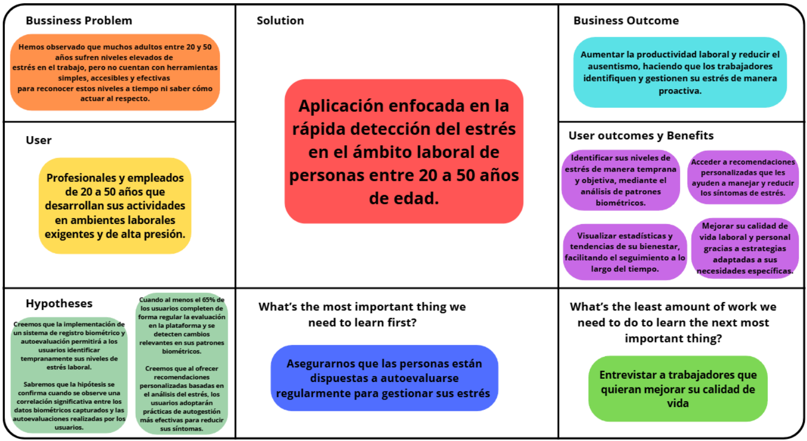

## 1.3. Segmentos Objetivos

#### Segmento objetivo #1: Personas activas en el ámbito laboral:

Este segmento está compuesto por personas con horario de trabajo extensos, de más de 8 horas laborales. Estos ciudadanos suelen experimentar una presión psicológica alta en sus trabajos lo cuál termina en generar un cuadro de estrés que puede perjudicar su rendimiento y su calidad de vida. Según estudios realizados en distintos campos laborales, un 70% del personal presenta un estrés
agudo en sus actividades personales y laborales (Estudio LATAM, 2020). Este grupo ves clave para el éxito de la plataforma, ya que son los principales beneficiarios de las capacidades que propone este startup

#### Segmento objetivo #2: Adultos entre 20 y 50 años de edad:

Este segmento incluye personas que no necesariamente sean trabajadores formales. A menudo, son las que más experimentan grados de estrés, ya que no se rigen a un horario de trabajo, sino que su trabajo está presente a todas horas del día. Según un estudio realizado a 250 trabajadores informales se expresa que el 56% de ellos muestran nivel medio de estrés, mientras que el 33.3% está en un nivel bajo y solo el 10.6% está en un nivel alto (Porcayo, 2022). Este grupo obtendrá los mismos beneficios que el otro segmento objetivo, pero este tiene más potencial de expandir el tema del estrés laboral y por consecuencia el uso de esta plataforma.

# 2. Capítulo II: Requirements Elicitation & Analysis

---

## 2.1 Competidores

En este apartado analizaremos las posibles competencias para nuestra página web,
viendo en ello sus descripciones y planes de negocios.

| Competidores | Características                                                                                                                                                                                                                                                                              | Diferencias                                                                                                                                                                                              | Limitaciones                                                                                                                                                          |
| ------------ | -------------------------------------------------------------------------------------------------------------------------------------------------------------------------------------------------------------------------------------------------------------------------------------------- | -------------------------------------------------------------------------------------------------------------------------------------------------------------------------------------------------------- | --------------------------------------------------------------------------------------------------------------------------------------------------------------------- |
| **Calm**     | - Contiene un ejercicio de respiración para reducir el estrés. - Cursos de 10 minutos al día para reducir el estrés. - Ejercicios físicos tipo meditaciones para relajar el cuerpo. - Historias en audiolibro para dormir mejor.                                                    | - Enfoque multimedia de alta producción con audios narrados por celebridades y música profesional. - Contenido especializado por necesidad (estrés, concentración, sueño).                            | - La mayoría del contenido requiere suscripción de pago. - No tiene controles parentales para gestionar el uso infantil.                                           |
| **Wysa**     | - Chatbot de apoyo emocional impulsado por IA. - Ejercicios como respiraciones guiadas, meditaciones y relajación muscular. - Privacidad: no requiere nombre real y las conversaciones son anónimas. - Versión de pago con acceso a terapeutas profesionales.                       | - Interfaz conversacional con IA (diferente a Calm con audio y Equoo con juegos). - Incorpora técnicas de CBT y DBT guiadas. - Modelo freemium claro (chatbot gratuito + coaching humano de pago). | - No puede atender emergencias de salud mental ni sustituir atención profesional. - Limitaciones técnicas para comprender lenguaje complejo y matices emocionales. |
| **Equoo**    | - Usa Terapia Cognitiva Conductual y psicología positiva para enseñar habilidades emocionales. - Juego con 52 niveles sobre neuroticismo, amabilidad y reciprocidad. - Chatbot personalizado de apoyo. - Estudios clínicos respaldan su eficacia para reducir ansiedad y depresión. | - Experiencia gamificada con misiones y recompensas. - Orientación a jóvenes con narrativa adaptada. - Progresión tipo “nivel” con estadísticas, ausente en Calm y Wysa.                           | - Variedad limitada de juegos emocionales, lo que puede volverse repetitivo. - El enfoque gamificado puede no resonar con quienes prefieren métodos más directos.  |

### 2.1.1. Análisis competitivo

| Criterio                                          | Calm                                                                                                                                                                                                      | Wysa                                                                                                                                                                          | Equoo                                                                                                                             |
| :------------------------------------------------ | :-------------------------------------------------------------------------------------------------------------------------------------------------------------------------------------------------------- | :---------------------------------------------------------------------------------------------------------------------------------------------------------------------------- | :-------------------------------------------------------------------------------------------------------------------------------- |
| **Perfil: Descripción**                           | Aplicación de bienestar mental para relajarse, dormir mejor y reducir el estrés. Ofrece meditaciones guiadas, historias para dormir, música relajante, ejercicios de respiración y clases de mindfulness. | Asistente de bienestar emocional basado en IA que ofrece terapia cognitivo-conductual (CBT), terapia dialéctica conductual (DBT), journaling y meditaciones, disponible 24/7. | Plataforma gamificada que desarrolla inteligencia emocional mediante juegos interactivos basados en psicología.                   |
| **Ventaja Competitiva**                           | Diversidad de maneras para relajarse; efectivo para cualquier necesidad.                                                                                                                                  | Combina un chatbot accesible 24/7 con técnicas terapéuticas validadas, y la opción de coaching humano para apoyo más profundo.                                                | Combina entretenimiento con técnicas psicológicas efectivas, aumentando la adherencia y el compromiso en el desarrollo emocional. |
| **Perfil de Marketing: Mercado Objetivo**         | Adultos entre 30 y 35 años con ingresos medio-altos que puedan pagar una suscripción.                                                                                                                     | Adultos jóvenes (18-35) y empresas que buscan herramientas de salud mental accesibles 24/7.                                                                                   | Adultos jóvenes (18-35), profesionales estresados, empresas e instituciones educativas.                                           |
| **Perfil de Marketing: Estrategias de marketing** | Modelo freemium, marketing con celebridades y alianzas con empresas.                                                                                                                                      | Marketing de contenidos, alianzas B2B y ASO con campañas en Instagram y LinkedIn.                                                                                             | Contenido educativo, partnerships B2B, campañas en redes sociales y pruebas gratuitas.                                            |
| **Perfil de Producto: Productos & Servicios**     | Meditaciones guiadas, historias para dormir, música relajante, ejercicios de respiración, clases de movimientos.                                                                                          | Chatbot gratuito con CBT/DBT y "pathways" temáticos; sesiones premium con coaches humanos.                                                                                    | App de entrenamiento emocional, versión empresarial y evaluaciones personalizadas.                                                |
| **Perfil de Producto: Precios & Costos**          | **Freemium**; plan mensual **15 USD**, anual **70 USD**, familiar **100 USD**, de por vida **400 USD**.                                                                                                   | **Freemium**; plan mensual **12 USD**, anual **19 USD**; tarifas corporativas variables.                                                                                      | **Freemium**; plan individual **$5-10/mes**, planes corporativos por volumen.                                                     |
| **Perfil de Producto: Canales de Distribución**   | App móvil (iOS/Android); plataforma web para empresas y coaching.                                                                                                                                         | App móvil (iOS/Android); plataforma web para empresas y coaching.                                                                                                             | Apps móviles (iOS/Android); plataforma web; integración con sistemas corporativos.                                                |
| **Análisis SWOT: Fortalezas**                     | Disponible 24/7, diversidad de opciones en la aplicación.                                                                                                                                                 | Disponible 24/7, técnicas terapéuticas validadas e interfaz intuitiva.                                                                                                        | Base científica sólida, formato atractivo, enfoque preventivo.                                                                    |
| **Análisis SWOT: Debilidades**                    | Precio elevado, no ofrece sesiones en vivo, enfoque principal para angloparlantes.                                                                                                                        | No reemplaza terapia presencial, contenido gratuito limitado, calidad dependiente de la IA.                                                                                   | Alta competencia, creación continua de contenido, percepción de ser una solución "ligera".                                        |
| **Análisis SWOT: Oportunidades**                  | Expansión internacional, integración con servicios de salud mental profesional.                                                                                                                           | Expansión en nuevos mercados, alianzas con telemedicina y wearables, localización cultural.                                                                                   | Creciente interés en salud mental, expansión internacional, integraciones tecnológicas.                                           |
| **Análisis SWOT: Amenazas**                       | Competencia intensa, precios más asequibles en otras apps.                                                                                                                                                | Competencia intensa, regulaciones de salud digital, preocupaciones por privacidad de datos.                                                                                   | Saturación del mercado, cambios en políticas de privacidad, escepticismo sobre la eficacia digital.                               |

## 2.1.2. Estrategias y tácticas frente a competidores

**FODA de nuestra empresa: "NeuroZen"**

F: Sistema de detección rápida de estrés laboral con test personalizados y conexión directa a
profesionales de salud mental.

O: Creciente conciencia sobre salud mental en empresas y mayor disposición a invertir en bienestar
laboral.

D: Posible resistencia de los usuarios a reconocer problemas de estrés y dependencia de la honestidad
en las respuestas al test.

A: Aparición de soluciones similares en el mercado y preocupaciones sobre confidencialidad de datos
sensibles de salud mental.

Para aprovechar las fortalezas y oportunidades de "NeuroZen", y al mismo tiempo enfrentar las
debilidades y contrarrestar las amenazas del entorno competitivo, podemos considerar las siguientes
estrategias y tácticas:

● Desarrollar programas de implementación corporativa que incluyan talleres de sensibilización
sobre la importancia de la salud mental.

● Establecer alianzas con empresas de seguros médicos para ofrecer descuentos a
organizaciones que implementen nuestro sistema preventivo.

● Implementar tecnología de análisis de comportamiento que complemente las respuestas
subjetivas del test con indicadores objetivos.

● Crear un sólido programa de certificación en privacidad de datos y comunicarlo claramente a
usuarios y empresas clientes.

● Generar reportes anónimos agregados para departamentos de RR.HH. que muestren el ROI en
términos de reducción de ausentismo y mejora de productividad.

## 2.2. Entrevistas.

---

## 2.2.1. Diseño de entrevistas.

**Segmento: Personas activas en el ámbito laboral con jornadas extendidas**

Para evaluar las necesidades y experiencias de profesionales con horarios laborales extensos que
enfrentan altos niveles de estrés, hemos desarrollado una serie de preguntas enfocadas en comprender
su rutina diaria, factores estresantes, y estrategias actuales para manejar la presión laboral. Esta
información nos permitirá identificar oportunidades para que nuestra plataforma ofrezca soluciones
efectivas que mejoren su calidad de vida y rendimiento profesional.

Introducción:

Buenos días/tardes, soy [...], representante de [Nombre del Proyecto]. Estamos
desarrollando una plataforma destinada a ayudar a profesionales con horarios laborales extensos a
manejar mejor el estrés y mejorar su calidad de vida. Nos gustaría conocer más sobre tu experiencia
laboral y los desafíos que enfrentas en tu día a día. Tu perspectiva será muy valiosa para desarrollar
una solución que realmente responda a las necesidades de personas como tú.

Preguntas:

1. Para comenzar, ¿podrías presentarte y contarnos brevemente sobre tu profesión y el sector en
   el que trabajas?
2. ¿Cómo describirías una jornada laboral típica para ti? ¿Cuántas horas trabajas habitualmente?
3. ¿Qué aspectos de tu trabajo consideras que generan mayor presión o estrés?
4. ¿Has notado cambios en tu salud física o mental que atribuyas al estrés laboral?
5. ¿Cómo suele afectar el estrés laboral a tu rendimiento en el trabajo y a tu vida personal?
6. ¿Qué estrategias utilizas actualmente para manejar el estrés relacionado con tu trabajo?
7. ¿Tu empresa o lugar de trabajo ofrece algún programa o recurso para ayudar a los empleados
   a manejar el estrés?
8. En los momentos de mayor presión laboral, ¿qué tipo de apoyo o herramientas te resultarían
   más útiles?
9. ¿Utilizas actualmente alguna aplicación o plataforma digital para gestionar el estrés o mejorar
   tu bienestar? Si es así, ¿cuál y qué te parece?
10. ¿Qué características o funcionalidades consideras importantes en una plataforma diseñada
    para ayudar a reducir el estrés laboral?

**Segmento: Adultos entre 20 y 50 años con trabajo informal o sin horarios definidos**

Para evaluar las necesidades y experiencias de adultos que trabajan en el sector informal o con
horarios no definidos, hemos desarrollado preguntas orientadas a comprender cómo manejan sus
tiempos, los factores estresantes específicos de su situación laboral y sus mecanismos actuales para
gestionar el estrés. Esta información nos permitirá adaptar nuestra plataforma para ofrecer soluciones
que respondan a las características particulares de este segmento, que según estudios, experimenta
niveles variables de estrés debido a la naturaleza omnipresente de su trabajo.

Introducción:

Buenos días/tardes, soy [...], representante de NeuroZen. Estamos desarrollando una
plataforma para ayudar a personas que trabajan sin horarios fijos o en el sector informal a manejar
mejor el estrés y mejorar su calidad de vida. Nos interesa conocer tu experiencia para crear una
solución que realmente funcione para personas como tú. Agradecemos mucho tu tiempo y sinceridad
en esta conversación.

Preguntas:

1. Para empezar, ¿podrías contarnos a qué te dedicas y cómo es tu rutina de trabajo habitual?
2. ¿Cómo organizas tu tiempo entre el trabajo y otras actividades? ¿Tienes algún método para
   establecer límites?
3. ¿Sientes que tu trabajo "te sigue a todas partes"? ¿Puedes describir cómo es esa experiencia?
4. ¿Cuáles son los principales factores que te generan estrés en tu trabajo?
5. ¿Cómo describirías el nivel de estrés que experimentas habitualmente (bajo, medio, alto)?
   ¿Varía mucho dependiendo de las temporadas o circunstancias?
6. ¿De qué manera crees que el no tener un horario fijo afecta tu nivel de estrés, en comparación
   con trabajos formales con horarios establecidos?
7. ¿Has notado algún impacto en tu salud física o mental debido al estrés relacionado con tu
   trabajo?
8. ¿Qué estrategias o métodos utilizas actualmente para manejar el estrés cuando sientes que el
   trabajo invade todos los aspectos de tu vida?
9. ¿Utilizas alguna aplicación, plataforma o recurso digital para ayudarte a organizar tu trabajo o
   manejar el estrés? ¿Cuál ha sido tu experiencia?
10. ¿Qué momentos del día considerarías más apropiados para dedicar tiempo a actividades para
    reducir el estrés?

## 2.2.2. Registro de entrevistas

**Segmento 1: Personas activas en el ámbito laboral con jornadas extendidas**

Entrevista N°1

● Nombre: Enzo Joaquín Alatrista Amaya.

● Sexo: Masculino.

● Edad: 25.

● Estado Civil: Soltero.

● Labor: Ingeniero de Sistemas.

Detalles de la entrevista:

● Duración: 03:26

[● Link: https://drive.google.com/file/d/13V0bp8f4mNgHBX6nU5c74mhhuCYzXYmT/view?usp=sharing](https://drive.google.com/file/d/13V0bp8f4mNgHBX6nU5c74mhhuCYzXYmT/view?usp=sharing)

Resumen de los puntos clave en la entrevista:

La entrevista con Enzo, ingeniero de sistemas de 25 años, revela el alto nivel de presión en el
sector tecnológico. Sus jornadas laborales de hasta 11 horas, sumadas a la disponibilidad
constante y los cambios de último minuto, han afectado su salud con insomnio, dolores de
cabeza e irritabilidad. Esto impacta su productividad y vida personal, generando agotamiento
emocional. Aunque intenta manejar el estrés con caminatas y ejercicios de respiración, su
rutina no le permite ser constante. Su empresa no ofrece apoyo real para el manejo del estrés,
más allá de charlas esporádicas. Enzo valora herramientas simples y accesibles, con
recordatorios para pausas, ejercicios rápidos y la opción de contactar a un profesional desde
la misma app.

Entrevista N°2

● Nombre: Andrés Luján Carrión

● Sexo: Masculino

● Edad: 40

● Estado Civil: Soltero

● Labor: Rector(USL)

Detalles de la entrevista:

● Duración: 4min11seg

[● Link: https://drive.google.com/file/d/1aePzhaW86rM-1leKeeb1c65SbWk9Y0yZ/view?usp=sharing](https://drive.google.com/file/d/1aePzhaW86rM-1leKeeb1c65SbWk9Y0yZ/view?usp=sharing)

Resumen de los puntos clave en la entrevista:

- El entrevistado trabaja entre 10 y 12 horas diarias.
- Su principal fuente de estrés son la necesidad de resultados rápidos frente a cambios que
  requieren tiempo.
- Ha notado fatiga mental, insomnio y tensión muscular.
- Le parecerían útiles herramientas como coaching personalizado y plataformas digitales.
- Le gustaría que la aplicación contase con coaching emocional, seguimiento de estrés y una
  comunidad de apoyo.

**Segmento 2: Adultos entre 20 y 50 años con trabajo informal o sin horarios definidos**

Entrevista N°3

● Nombre: Cristofer Pablo Paucar

● Sexo: Masculino

● Edad: 21

● Estado Civil: Soltero

● Labor: Repartidor

Detalles de la entrevista:

● Duración: 6:27

[● Link: https://drive.google.com/file/d/1SRe3Ilrde37SMS8YGALvpk9OqU4jpwh0/view?usp=sharing](https://drive.google.com/file/d/1SRe3Ilrde37SMS8YGALvpk9OqU4jpwh0/view?usp=sharing)

Resumen de los puntos clave en la entrevista:

La entrevista con Cristofer Paucar, un repartidor delivery de 21 años que trabaja sin un
horario fijo. Organiza su jornada en función de la demanda y necesidades económicas, lo que
implica horarios variables que a menudo se extienden hasta la noche. Reconoce que tiene
dificultades para establecer límites entre su vida personal y laboral, ya que su trabajo "lo
sigue a todas partes" debido a la constante atención al celular.
Los principales factores de estrés que enfrenta son la inestabilidad laboral, la incertidumbre
económica, fallas en las aplicaciones de reparto, el tráfico, clientes exigentes y el desgaste
físico. Califica su nivel de estrés como medio, aunque se eleva en situaciones específicas
como fines de mes o días lluviosos.

Cristofer considera que la falta de un horario fijo agrava el estrés al dificultar la separación
entre el trabajo y la vida personal. Ha notado efectos negativos en su salud física y mental,
incluyendo dolores corporales, cansancio, insomnio e irritabilidad. Para manejar el estrés,
intenta desconectarse ocasionalmente, escuchar música o realizar actividades recreativas,
aunque no siempre lo logra. Si bien usa aplicaciones básicas para organizar su vida personal,
no emplea herramientas específicas para el manejo del estrés, pero le gustaría explorar
alguna. Identifica la mañana y la noche como los momentos más adecuados para realizar
actividades relajantes, aunque muchas veces depende del flujo de trabajo diario.

Entrevista N°4

● Nombre: Laura Méndez

● Sexo: Mujer

● Edad: 24 años

● Estado Civil: Soltera

● Labor: Freelancer diseñadora gráfica y fotógrafa de eventos

Detalles de la entrevista:

● Duración: 8 minutos con 39 segundos

[● Link: https://drive.google.com/file/d/1qmh7C8VD0SDWj4DvPe7hUj3HFCdga7o5/view?usp=sharing](https://drive.google.com/file/d/1qmh7C8VD0SDWj4DvPe7hUj3HFCdga7o5/view?usp=sharing)

Resumen de los puntos clave en la entrevista:

La entrevista con Laura Méndez, una diseñadora gráfica freelance y fotógrafa de 24 años,
revela los desafíos únicos que enfrenta como trabajadora con horarios irregulares. Su
situación laboral se caracteriza por la ausencia de límites entre vida personal y profesional,
con un teléfono que funciona como "oficina móvil" y clientes que esperan disponibilidad
constante. Los principales factores de estrés identificados incluyen la inestabilidad económica
que la lleva a sobrecargarse de trabajo, las expectativas poco realistas de los clientes, y la
imposibilidad de desconectar completamente, resultando en un nivel de estrés medio-alto con
picos que afectan su salud física y creatividad. Aunque intenta implementar estrategias como
yoga o ejercicio, estas prácticas son inconsistentes debido a su carga laboral, por lo que
necesita soluciones flexibles que se adapten a su ritmo caótico: herramientas rápidas
accesibles desde el móvil, técnicas para establecer límites sin perder clientes y métodos
efectivos para "apagar" su mente al finalizar la jornada.

## 2.2.3. Análisis de entrevistas

**Segmento 1: Personas activas en el ámbito laboral con jornadas extendidas**

Hallazgos:

● Los profesionales experimentan jornadas laborales extendidas de 10-12 horas diarias,
sin límites claros entre vida laboral y personal.

● Enfrentan presión constante por resultados inmediatos ante cambios que requieren
tiempo.

● Presentan síntomas físicos y emocionales similares: fatiga mental, insomnio, tensión
muscular, irritabilidad y dolores de cabeza.

● Las empresas ofrecen poco o nulo apoyo real para el manejo del estrés laboral.

● Aunque intentan implementar técnicas de manejo del estrés, la carga laboral impide
ser constantes.

● Valoran soluciones digitales accesibles, rápidas y adaptables a sus horarios saturados.

Conclusión:

Los profesionales con jornadas extendidas constituyen un segmento vulnerable al estrés
crónico debido a la combinación de largas horas de trabajo, disponibilidad permanente y
presión por resultados inmediatos. Sus intentos individuales de manejar el estrés mediante
técnicas convencionales resultan insuficientes ante la falta de límites laborales claros y apoyo
institucional. Este grupo necesita soluciones tecnológicas personalizadas que se integren
fácilmente a su rutina, ofrezcan intervenciones breves pero efectivas, y proporcionen tanto
seguimiento automatizado como acceso a apoyo profesional cuando sea necesario. La
aplicación debe enfocarse en crear micro hábitos de bienestar que puedan sostenerse incluso
en entornos laborales exigentes, permitiéndoles recuperar el equilibrio sin comprometer su
desempeño profesional.

**Segmento 2: Adultos entre 20 y 50 años con trabajo informal o sin horarios definidos**

Hallazgos:

● Ausencia de límites trabajo-vida personal: Ambos experimentan una fusión entre su
vida laboral y personal, con el teléfono móvil como vínculo constante al trabajo.

● Horarios irregulares: Ninguno tiene un horario fijo, organizándose según demanda y
necesidades económicas.

● Principales factores de estrés: Comparten preocupaciones por la inestabilidad
económica, las expectativas de disponibilidad constante y la dificultad para
desconectar.

● Impacto en la salud: Ambos reportan efectos negativos como dolores físicos,
cansancio e irritabilidad.

● Estrategias de afrontamiento inconsistentes: Aunque intentan aplicar métodos para
manejar el estrés (música, ejercicio, yoga), no logran mantenerlos de forma regular.

● Necesidad de herramientas adaptables: Los dos expresan interés en explorar
soluciones que se ajusten a sus horarios variables.

Conclusión:

Los testimonios de Cristofer y Laura revelan una realidad laboral cada vez más común:
trabajadores con horarios flexibles que enfrentan una constante disponibilidad laboral
mediada por dispositivos móviles, generando una difuminación de límites entre trabajo y vida
personal que impacta negativamente su bienestar. Esta situación crea un ciclo donde la
inestabilidad económica los impulsa a aceptar más trabajo, intensificando el estrés y
deteriorando su salud física y mental. Sus casos evidencian la necesidad urgente de
desarrollar herramientas y estrategias específicamente diseñadas para trabajadores con
horarios irregulares, que sean accesibles desde dispositivos móviles, requieran poco tiempo
de implementación y ayuden efectivamente a establecer límites saludables sin comprometer
su sustento económico.

## 2.3. Needfinding

Al recopilar toda la información de los segmentos objetivo y realizar las entrevistas se hará
un análisis de estos mismos haciendo uso de User Persona, Task Matrix, Journey Mapping,
Empathy Mapping y As-Is Scenario Mapping.

### 2.3.1. User Personas.

  
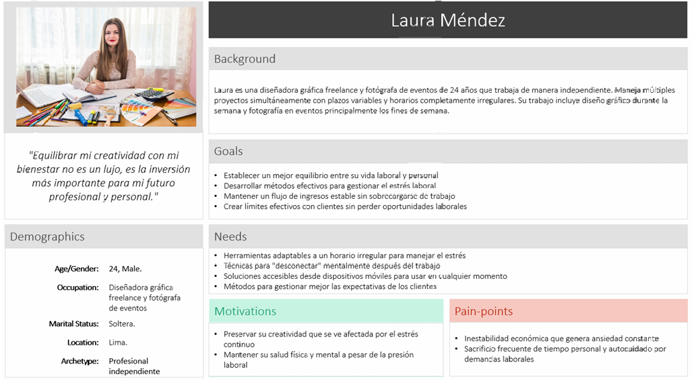

  
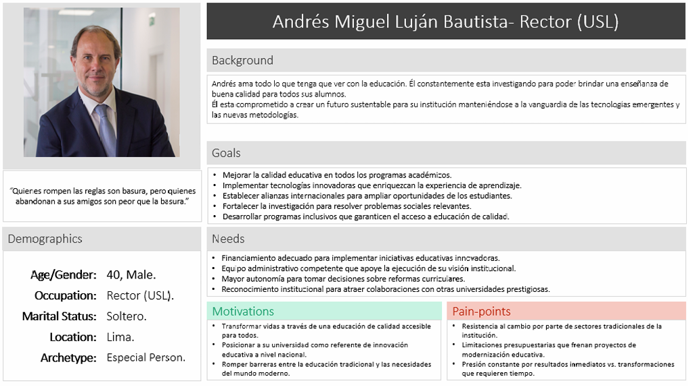

### 2.3.2. User Task Matrix.

| Tareas                                                     | Laura Méndez |             | Andrés Luján |             |
| :--------------------------------------------------------- | :----------- | :---------- | :----------- | :---------- |
|                                                            | Frecuencia   | Importancia | Frecuencia   | Importancia |
| **Registrar señales corporales de estrés**                 | Media        | Media       | Alta         | Alta        |
| **Completar autoevaluación de niveles de estrés**          | Media        | Alta        | Alta         | Media       |
| **Consultar análisis de patrones de estrés**               | Alta         | Media       | Media        | Alta        |
| **Acceder a recomendaciones personalizadas**               | Media        | Alta        | Alta         | Alta        |
| **Registrar seguimiento de implementación de estrategias** | Media        | Alta        | Alta         | Alta        |

### 2.3.3. User Journey Mapping.

  
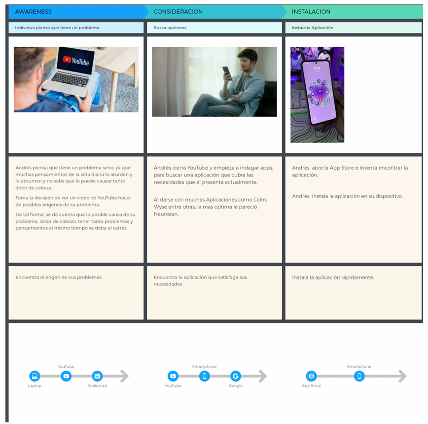

  
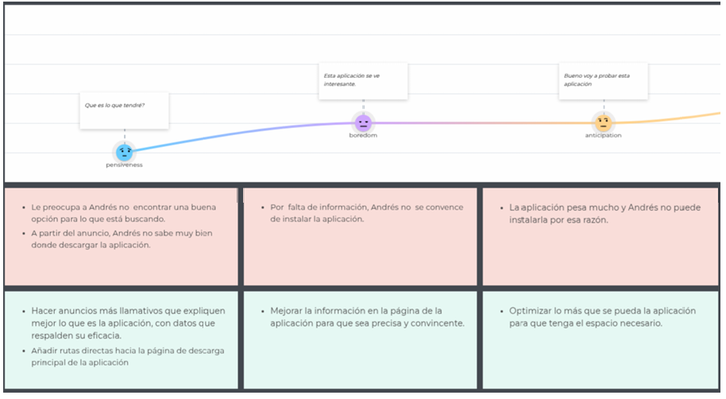

  
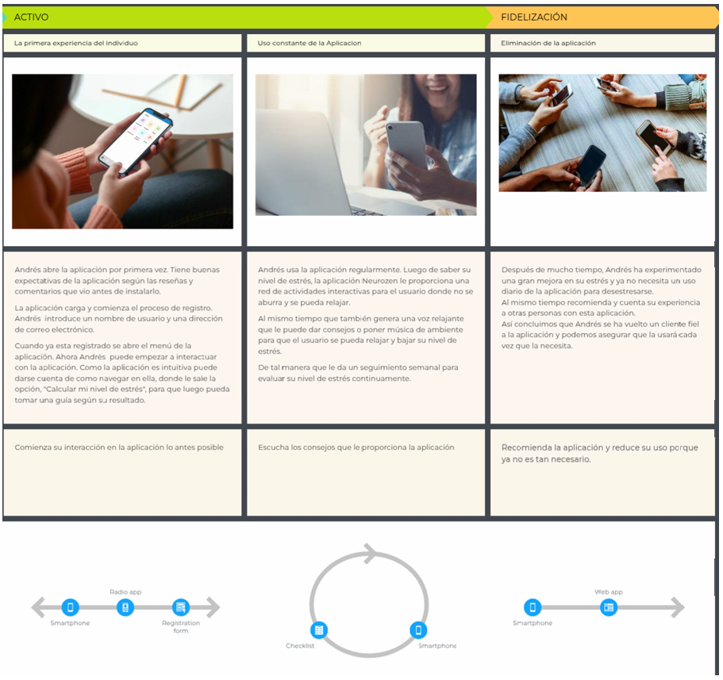

  
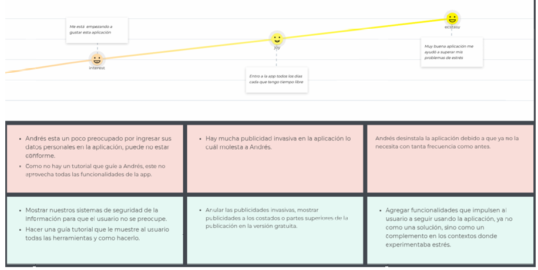

### 2.3.4. Empathy Mapping.

  
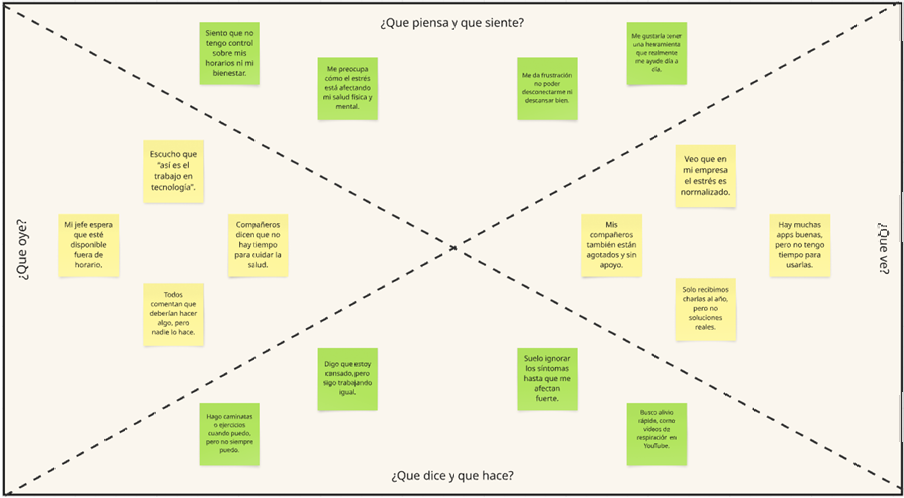

  
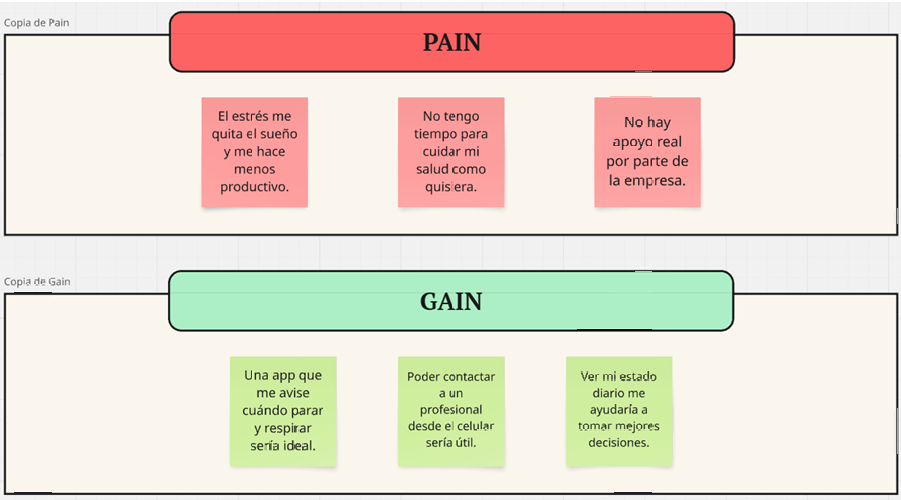

  
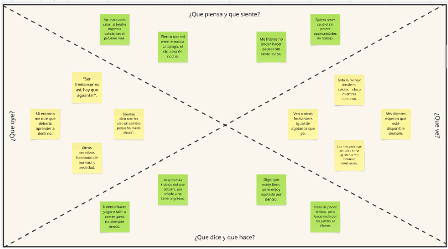

  
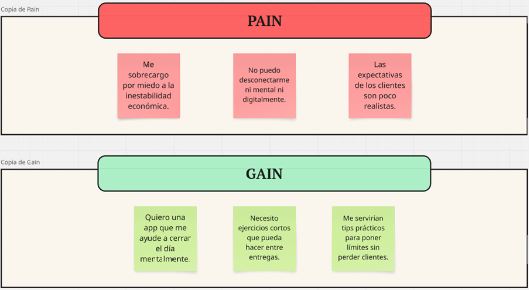

### 2.3.5. As-is Scenario Mapping.

**As-is Scenario Mapping de Laura Méndez**

| Phases       | Registrar señales corporales de estrés                | Completar autoevaluación de niveles de estrés   | Consultar análisis de patrones de estrés            | Acceder a recomendaciones personalizadas                         | Registrar seguimiento de implementación de estrategias                |
| :----------- | :---------------------------------------------------- | :---------------------------------------------- | :-------------------------------------------------- | :--------------------------------------------------------------- | :-------------------------------------------------------------------- |
| **Doing**    | Toma fotos de su postura durante horas de trabajo.    | Completa cuestionarios rápidos entre proyectos. | Revisa los gráficos semanales de estrés.            | Accede a recomendaciones desde su teléfono móvil.                | Registra la efectividad de las técnicas implementadas.                |
| **Thinking** | Duda si está estresada o solo cansada.                | Evalúa si está aceptando demasiados proyectos.  | Busca patrones relacionados con ciertos clientes.   | Cuestiona si las recomendaciones se adaptan a su estilo de vida. | Se pregunta si está siendo constante con las técnicas.                |
| **Feeling**  | Se siente abrumada al notar signos físicos de estrés. | Siente alivio al cuantificar su estrés.         | Muestra curiosidad al descubrir patrones de estrés. | Experimenta esperanza al recibir nuevas estrategias.             | Siente orgullo cuando logra implementar estrategias consistentemente. |

**As-is Scenario Mapping de Andrés Luján**

| Phases       | Registrar señales corporales de estrés                          | Completar autoevaluación de niveles de estrés                            | Consultar análisis de patrones de estrés                                | Acceder a recomendaciones personalizadas                                   | Registrar seguimiento de implementación de estrategias                   |
| :----------- | :-------------------------------------------------------------- | :----------------------------------------------------------------------- | :---------------------------------------------------------------------- | :------------------------------------------------------------------------- | :----------------------------------------------------------------------- |
| **Doing**    | Documenta su tensión muscular después de reuniones prolongadas. | Realiza evaluaciones al final de su jornada laboral.                     | Analiza tendencias de estrés durante diferentes períodos académicos.    | Revisa el coaching emocional personalizado entre reuniones.                | Registra diariamente la efectividad de las estrategias implementadas.    |
| **Thinking** | Se pregunta si su fatiga es visible para su equipo.             | Considera cómo los cambios institucionales afectan su nivel de estrés.   | Reflexiona sobre la relación entre sus horas de trabajo y su bienestar. | Evalúa qué recomendaciones son viables con su apretada agenda.             | Analiza qué técnicas funcionan mejor durante temporadas de alta presión. |
| **Feeling**  | Se siente frustrado al reconocer signos físicos de agotamiento. | Experimenta preocupación al constatar altos niveles de estrés sostenido. | Siente determinación al identificar patrones problemáticos.             | Muestra optimismo al encontrar soluciones adaptadas a su rol de liderazgo. | Siente satisfacción cuando logra incorporar nuevos hábitos a su rutina.  |

## 2.4. Big Picture Event Storming.

En la sesión de Big Picture Event Storming, el equipo plasmó los eventos significativos del dominio y sus relaciones, explorando de manera visual el panorama general del negocio. Se representaron los procesos clave y se integraron los sistemas externos que interactúan con la solución, identificando además dudas, problemas y oportunidades de mejora. Esta primera aproximación permitió comprender mejor el landscape del negocio y sentar las bases para un análisis más detallado en etapas posteriores.

### Big Picture Event Storming - Mapa General

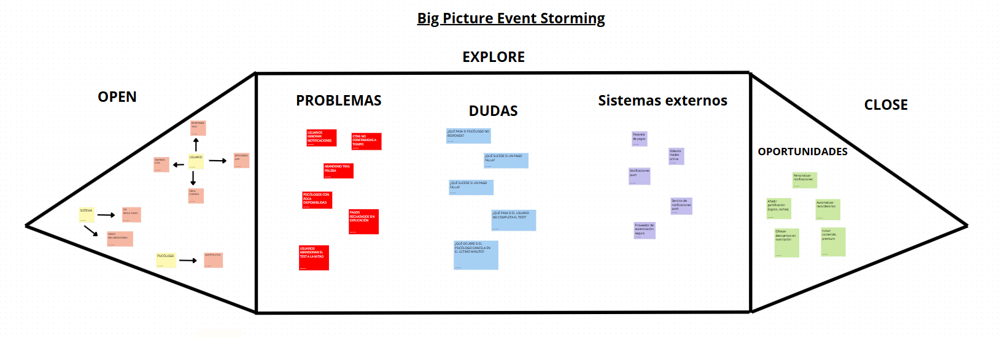

### Big Picture Event Storming - Leyenda de Colores

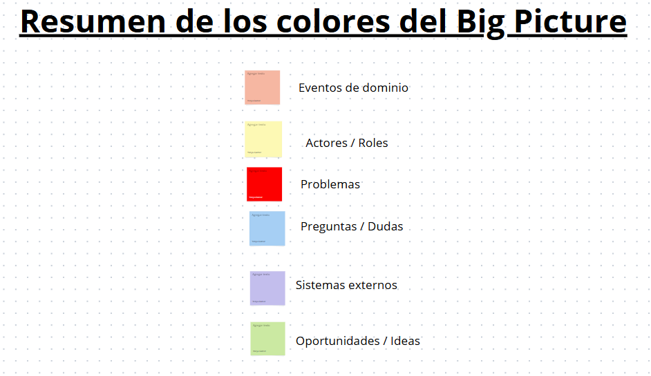

## 2.5. Ubiquitous Language.

Este glosario define los términos clave que usamos en el proyecto para mantener un lenguaje común entre el equipo de desarrollo y los expertos en salud mental.

| Término                            | Definición                                                                                                                     |
| ---------------------------------- | ------------------------------------------------------------------------------------------------------------------------------ |
| **Usuario**                        | Persona adulta (20–50 años) que utiliza la app para evaluar, monitorear y gestionar su estrés laboral.                         |
| **Perfil biométrico**              | Conjunto de datos físicos iniciales del usuario (postura, rostro, respiración) que sirven como línea base.                     |
| **Test de autoevaluación**         | Cuestionario digital que mide síntomas y sensaciones de estrés percibidas por el usuario.                                      |
| **Análisis biométrico**            | Proceso de escaneo mediante la cámara/sensores para detectar señales físicas de estrés.                                        |
| **Síntomas físicos**               | Manifestaciones registradas por el usuario, como dolores de cabeza, insomnio, tensión muscular.                                |
| **Nivel de estrés**                | Clasificación automática (bajo, medio, alto) que combina datos de tests y biometría.                                           |
| **Recomendaciones personalizadas** | Consejos, ejercicios o pausas sugeridas por la app en base al estado actual del usuario.                                       |
| **Ejercicios de respiración**      | Actividad guiada por la app para reducir la tensión y ansiedad en pocos minutos.                                               |
| **Pausas activas**                 | Recordatorios programados que invitan al usuario a descansar o hacer micro ejercicios durante la jornada laboral.              |
| **Dashboard personal**             | Panel con estadísticas, tendencias y patrones de estrés en el tiempo.                                                          |
| **Desencadenante de estrés**       | Evento o situación registrada por el usuario que provoca incremento de su estrés (ej. exceso de trabajo, conflictos, tráfico). |
| **Informe de progreso**            | Documento generado con evolución de estrés y hábitos del usuario, que puede compartirse con un psicólogo.                      |
| **Especialista en salud mental**   | Psicólogo disponible en la plataforma para consultas y tratamiento profesional.                                                |
| **Cita**                           | Agendamiento de una sesión con un especialista, virtual o presencial.                                                          |
| **Grupo de apoyo**                 | Comunidad virtual de usuarios que comparten experiencias y consejos sobre el manejo del estrés.                                |
| **Biblioteca de recursos**         | Colección digital de artículos, videos o guías relacionadas al bienestar laboral y manejo del estrés.                          |

# 3. Capítulo III: Requirements Specification

---

## 3.1. To-Be Scenario Mapping

**User Journey Mapping – Laura Méndez**

| Fases                                         | Doing                                                    | Thinking                                                                | Feeling                                             |
| --------------------------------------------- | -------------------------------------------------------- | ----------------------------------------------------------------------- | --------------------------------------------------- |
| Registrar señales corporales de estrés        | La app detecta automáticamente postura y signos faciales | “Es útil que el sistema registre señales sin que yo tenga que hacerlo.” | Tranquilidad por el monitoreo pasivo                |
| Completar autoevaluación de niveles de estrés | Recibe notificaciones de autoevaluación guiada con IA    | “Ahora sé si lo que siento es estrés o solo cansancio.”                 | Alivio por entender rápidamente su estado emocional |
| Consultar análisis de patrones de estrés      | Visualiza resúmenes visuales con predicción de picos     | “Ya puedo ver cómo ciertos clientes o días afectan mi bienestar.”       | Curiosidad y sensación de control                   |
| Acceder a recomendaciones personalizadas      | Recibe sugerencias integradas a su rutina diaria         | “Esto se adapta a mí y no interrumpe mi día.”                           | Esperanza al ver opciones viables                   |
| Registrar seguimiento de estrategias          | Ve sus avances con ayuda de recordatorios motivacionales | “Estoy logrando mantener el hábito, y se nota en mi bienestar.”         | Orgullo y motivación al ver progresos               |

**User Journey Mapping – Andrés Luján**

| Fases                                         | Doing                                                  | Thinking                                                   | Feeling                                      |
| --------------------------------------------- | ------------------------------------------------------ | ---------------------------------------------------------- | -------------------------------------------- |
| Registrar señales corporales de estrés        | El sistema registra tensión y postura automáticamente  | “El sistema me ayuda a notar lo que mi cuerpo expresa.”    | Alivio al no depender solo de su percepción  |
| Completar autoevaluación de niveles de estrés | Usa voz o toques rápidos para autoevaluarse            | “Esta evaluación se adapta a mis tiempos.”                 | Comodidad y sensación de autonomía           |
| Consultar análisis de patrones de estrés      | El sistema anticipa picos de estrés según su agenda    | “Puedo prever cuándo debo cuidarme más o delegar.”         | Seguridad al planificar estratégicamente     |
| Acceder a recomendaciones personalizadas      | Recibe recomendaciones justo después de momentos clave | “Estas estrategias están hechas para mi rol de liderazgo.” | Optimismo por la personalización del sistema |
| Registrar seguimiento de estrategias          | Revisa un resumen mensual con IA                       | “Sé qué funcionó y qué debo ajustar para el próximo mes.”  | Satisfacción por tener una guía continua     |

---

## 3.2. User Stories

**Epic**

| **EPIC ID** | **Nombre del Epic**                        | **Descripción**                                                                                                                                                                                                  |
| ----------- | ------------------------------------------ | ---------------------------------------------------------------------------------------------------------------------------------------------------------------------------------------------------------------- |
| EP01        | Registro y Configuración de Cuenta         | Como usuario nuevo, quiero registrarme, configurar mi perfil biométrico y completar un cuestionario inicial de salud, para acceder a la plataforma con un perfil personalizado y preciso.                        |
| EP02        | Detección y Evaluación del Estrés          | Como usuario, quiero evaluar mi nivel de estrés mediante autoevaluaciones, análisis biométricos y registro de síntomas, para obtener un diagnóstico completo de mi estado actual.                                |
| EP03        | Recomendaciones y Gestión del Estrés       | Como usuario diagnosticado con estrés, quiero recibir recomendaciones personalizadas, acceder a ejercicios de respiración y programar pausas activas, para reducir mis niveles de estrés y mejorar mi bienestar. |
| EP04        | Seguimiento y Análisis del Progreso        | Como usuario, quiero visualizar un dashboard personal, generar informes de progreso y registrar desencadenantes de estrés, para dar seguimiento a mi evolución y entender mis patrones de estrés.                |
| EP05        | Conexión con Especialistas en Salud Mental | Como usuario con necesidad de apoyo profesional, quiero buscar psicólogos, agendar citas y compartir informes, para recibir tratamiento especializado dentro de la plataforma.                                   |
| EP06        | Comunidad y Soporte Social                 | Como usuario, quiero participar en grupos de apoyo, acceder a una biblioteca de recursos y unirme a desafíos antiestrés, para sentir acompañamiento social y mantener la motivación en la gestión de mi estrés.  |
| EP07        | Integración con Entorno Laboral            | Como trabajador, quiero analizar mi carga laboral y recibir recordatorios de ergonomía, para prevenir sobrecarga y mejorar mi productividad sin comprometer mi bienestar.                                        |

**EP01 - Registro y Configuración de Cuenta**

| User Story ID | Título                                  |
| ------------: | --------------------------------------- |
|          US01 | Registrar cuenta de usuario             |
|          US02 | Configurar perfil biométrico            |
|          US03 | Completar cuestionario inicial de salud |

**EP02 - Detección y Evaluación del Estrés**

| User Story ID | Título                                    |
| ------------: | ----------------------------------------- |
|          US04 | Realizar test de autoevaluación de estrés |
|          US05 | Análisis biométrico de señales de estrés  |
|          US06 | Registro de síntomas físicos              |

**EP03 - Recomendaciones y Gestión del Estrés**

| User Story ID | Título                                     |
| ------------: | ------------------------------------------ |
|          US07 | Recibir recomendaciones personalizadas     |
|          US08 | Realizar ejercicios de respiración guiados |
|          US09 | Programar pausas activas laborales         |

**EP04 - Seguimiento y Análisis del Progreso**

| User Story ID | Título                                  |
| ------------: | --------------------------------------- |
|          US10 | Visualizar dashboard personal de estrés |
|          US11 | Generar informes de progreso            |
|          US12 | Registrar desencadenantes de estrés     |

**EP05 - Conexión con Especialistas en Salud Mental**

| User Story ID | Título                               |
| ------------: | ------------------------------------ |
|          US13 | Buscar psicólogos especializados     |
|          US14 | Agendar cita con psicólogo           |
|          US15 | Compartir informes con especialistas |

**EP06 - Comunidad y Soporte Social**

| User Story ID | Título                            |
| ------------: | --------------------------------- |
|          US16 | Participar en grupos de apoyo     |
|          US17 | Acceder a biblioteca de recursos  |
|          US18 | Participar en desafíos antiestrés |

**EP07 - Integración con Entorno Laboral**

| User Story ID | Título                             |
| ------------: | ---------------------------------- |
|          US19 | Analizar carga laboral             |
|          US20 | Recibir recordatorios de ergonomía |

| ID Épica | Épica                              | ID HU | Título HU                               | Descripción HU                                                                                                                     | Criterios de Aceptación                                                                                                                                                                                                                                                                                                                                                                            |
| -------- | ---------------------------------- | ----- | --------------------------------------- | ---------------------------------------------------------------------------------------------------------------------------------- | -------------------------------------------------------------------------------------------------------------------------------------------------------------------------------------------------------------------------------------------------------------------------------------------------------------------------------------------------------------------------------------------------- |
| EP01     | Registro y Configuración de Cuenta | US01  | Registrar cuenta de usuario             | Como nuevo usuario, quiero registrar una cuenta con mi correo o número de teléfono, para acceder a las funciones de la aplicación. | **Escenario 1: Registro exitoso** Dado que el usuario no tiene cuenta, Cuando ingresa sus datos obligatorios y acepta términos, Entonces el sistema crea la cuenta y envía verificación.  **Escenario 2: Registro fallido** Dado que el usuario ingresa datos inválidos, Cuando intenta registrarse, Entonces el sistema muestra mensaje de error y no crea cuenta.        |
| EP01     | Registro y Configuración de Cuenta | US02  | Configurar perfil biométrico            | Como usuario, quiero registrar mis datos biométricos para personalizar el análisis de estrés.                                      | **Escenario 1: Configuración inicial** Dado que el usuario tiene cuenta activa, Cuando registra o sincroniza datos biométricos, Entonces el sistema los guarda y usa en futuros análisis.  **Escenario 2: Error de sincronización** Dado que el usuario conecta un dispositivo, Cuando ocurre un error, Entonces el sistema muestra advertencia y permite reintentar.      |
| EP01     | Registro y Configuración de Cuenta | US03  | Completar cuestionario inicial de salud | Como usuario nuevo, quiero completar un cuestionario de salud para generar mi plan inicial.                                        | **Escenario 1: Cuestionario completado** Dado que el usuario accede al cuestionario inicial, Cuando responde todas las preguntas, Entonces el sistema guarda respuestas y genera perfil.  **Escenario 2: Cuestionario incompleto** Dado que el usuario abandona el cuestionario, Cuando vuelve a ingresar, Entonces el sistema permite retomar desde el progreso guardado. |

| ID Épica | Épica                             | ID HU | Título HU                                 | Descripción HU                                                                                      | Criterios de Aceptación                                                                                                                                                                                                                                                                                                             |
| -------- | --------------------------------- | ----- | ----------------------------------------- | --------------------------------------------------------------------------------------------------- | ----------------------------------------------------------------------------------------------------------------------------------------------------------------------------------------------------------------------------------------------------------------------------------------------------------------------------------- |
| EP02     | Detección y Evaluación del Estrés | US04  | Realizar test de autoevaluación de estrés | Como usuario, quiero realizar un test de estrés para conocer mi nivel actual.                       | **Escenario 1: Test completado** Dado que el usuario accede al test, Cuando responde todas las preguntas, Entonces el sistema muestra resultado inmediato.  **Escenario 2: Test incompleto** Dado que el usuario abandona el test, Cuando regresa, Entonces el sistema guarda progreso y permite retomarlo. |
| EP02     | Detección y Evaluación del Estrés | US05  | Análisis biométrico de señales de estrés  | Como usuario, quiero que la app analice mis datos biométricos para detectar estrés automáticamente. | **Escenario 1: Análisis exitoso** Dado que el usuario sincronizó su dispositivo, Cuando los datos se reciben, Entonces el sistema calcula nivel de estrés.  **Escenario 2: Datos insuficientes** Dado que faltan datos, Cuando se intenta analizar, Entonces el sistema notifica al usuario.                |
| EP02     | Detección y Evaluación del Estrés | US06  | Registro de síntomas físicos              | Como usuario, quiero registrar manualmente mis síntomas físicos para complementar el análisis.      | **Escenario 1: Registro exitoso** Dado que el usuario accede a “Síntomas”, Cuando ingresa información, Entonces el sistema guarda los datos.  **Escenario 2: Validación** Dado que el usuario omite un campo obligatorio, Cuando intenta guardar, Entonces el sistema solicita completar el campo.          |

| ID Épica | Épica                                | ID HU | Título HU                                  | Descripción HU                                                                | Criterios de Aceptación                                                                                                                                                                                                                                                                                                                                                                           |
| -------- | ------------------------------------ | ----- | ------------------------------------------ | ----------------------------------------------------------------------------- | ------------------------------------------------------------------------------------------------------------------------------------------------------------------------------------------------------------------------------------------------------------------------------------------------------------------------------------------------------------------------------------------------- |
| EP03     | Recomendaciones y Gestión del Estrés | US07  | Recibir recomendaciones personalizadas     | Como usuario, quiero recibir recomendaciones basadas en mi perfil de estrés.  | **Escenario 1: Recomendaciones generadas** Dado que el usuario completó cuestionario y biometría, Cuando accede a recomendaciones, Entonces el sistema muestra sugerencias personalizadas.  **Escenario 2: Falta de datos** Dado que el usuario no completó su perfil, Cuando intenta ver recomendaciones, Entonces el sistema muestra mensaje indicando datos faltantes. |
| EP03     | Recomendaciones y Gestión del Estrés | US08  | Realizar ejercicios de respiración guiados | Como usuario, quiero realizar ejercicios guiados para reducir el estrés.      | **Escenario 1: Ejercicio completado** Dado que el usuario selecciona un ejercicio, Cuando lo finaliza, Entonces el sistema registra la actividad.  **Escenario 2: Interrupción** Dado que el usuario abandona el ejercicio, Cuando regresa, Entonces el sistema permite reiniciar o continuar.                                                                            |
| EP03     | Recomendaciones y Gestión del Estrés | US09  | Programar pausas activas laborales         | Como usuario, quiero programar pausas para reducir mi carga laboral y estrés. | **Escenario 1: Pausa programada** Dado que el usuario accede a la agenda, Cuando programa una pausa, Entonces el sistema guarda recordatorio.  **Escenario 2: Notificación** Dado que se acerca la pausa, Cuando llega la hora, Entonces el sistema envía recordatorio.                                                                                                   |

| ID Épica | Épica                               | ID HU | Título HU                               | Descripción HU                                                                     | Criterios de Aceptación                                                                                                                                                                                                                                                                                                               |
| -------- | ----------------------------------- | ----- | --------------------------------------- | ---------------------------------------------------------------------------------- | ------------------------------------------------------------------------------------------------------------------------------------------------------------------------------------------------------------------------------------------------------------------------------------------------------------------------------------- |
| EP04     | Seguimiento y Análisis del Progreso | US10  | Visualizar dashboard personal de estrés | Como usuario, quiero ver mi estado actual de estrés en un dashboard.               | **Escenario 1: Dashboard con datos** Dado que el usuario tiene registros, Cuando ingresa al dashboard, Entonces el sistema muestra sus métricas.  **Escenario 2: Sin datos** Dado que no hay registros, Cuando accede, Entonces el sistema indica que aún no hay información.                                 |
| EP04     | Seguimiento y Análisis del Progreso | US11  | Generar informes de progreso            | Como usuario, quiero generar informes para evaluar mis avances.                    | **Escenario 1: Informe generado** Dado que el usuario selecciona un periodo, Cuando solicita un informe, Entonces el sistema genera reporte descargable.  **Escenario 2: Falta de datos** Dado que el usuario no tiene registros, Cuando intenta generar, Entonces el sistema muestra advertencia.            |
| EP04     | Seguimiento y Análisis del Progreso | US12  | Registrar desencadenantes de estrés     | Como usuario, quiero registrar situaciones que detonan mi estrés para analizarlas. | **Escenario 1: Registro exitoso** Dado que el usuario accede a “Desencadenantes”, Cuando ingresa información, Entonces el sistema guarda el registro.  **Escenario 2: Registro incompleto** Dado que el usuario no llena campos obligatorios, Cuando intenta guardar, Entonces el sistema solicita completar. |

| ID Épica | Épica                      | ID HU | Título HU                            | Descripción HU                                                                | Criterios de Aceptación                                                                                                                                                                                                                                                                                                                  |
| -------- | -------------------------- | ----- | ------------------------------------ | ----------------------------------------------------------------------------- | ---------------------------------------------------------------------------------------------------------------------------------------------------------------------------------------------------------------------------------------------------------------------------------------------------------------------------------------- |
| EP05     | Conexión con Especialistas | US13  | Buscar psicólogos especializados     | Como usuario, quiero buscar psicólogos según especialidad para recibir apoyo. | **Escenario 1: Búsqueda exitosa** Dado que el usuario accede a la búsqueda, Cuando ingresa criterios, Entonces el sistema muestra psicólogos disponibles.  **Escenario 2: Sin resultados** Dado que no hay coincidencias, Cuando busca, Entonces el sistema muestra mensaje indicando que no hay psicólogos.     |
| EP05     | Conexión con Especialistas | US14  | Agendar cita con psicólogo           | Como usuario, quiero agendar una cita en línea con un psicólogo.              | **Escenario 1: Cita agendada** Dado que el usuario selecciona especialista y horario, Cuando confirma, Entonces el sistema guarda la cita.  **Escenario 2: Conflicto de horario** Dado que ya existe una cita en ese horario, Cuando intenta reservar, Entonces el sistema muestra error y solicita otra opción. |
| EP05     | Conexión con Especialistas | US15  | Compartir informes con especialistas | Como usuario, quiero compartir mis informes de progreso con un psicólogo.     | **Escenario 1: Informe compartido** Dado que el usuario selecciona un informe, Cuando lo envía, Entonces el especialista recibe acceso.  **Escenario 2: Error de envío** Dado que ocurre una falla, Cuando intenta compartir, Entonces el sistema muestra mensaje de error.                                      |

| ID Épica | Épica                      | ID HU | Título HU                         | Descripción HU                                                               | Criterios de Aceptación                                                                                                                                                                                                                                                                                                   |
| -------- | -------------------------- | ----- | --------------------------------- | ---------------------------------------------------------------------------- | ------------------------------------------------------------------------------------------------------------------------------------------------------------------------------------------------------------------------------------------------------------------------------------------------------------------------- |
| EP06     | Comunidad y Soporte Social | US16  | Participar en grupos de apoyo     | Como usuario, quiero unirme a grupos de apoyo para compartir experiencias.   | **Escenario 1: Unión exitosa** Dado que el usuario accede a grupos, Cuando selecciona uno, Entonces el sistema lo agrega.  **Escenario 2: Grupo cerrado** Dado que el grupo requiere aprobación, Cuando solicita unirse, Entonces el sistema notifica que debe esperar confirmación.              |
| EP06     | Comunidad y Soporte Social | US17  | Acceder a biblioteca de recursos  | Como usuario, quiero acceder a artículos y videos sobre manejo del estrés.   | **Escenario 1: Acceso exitoso** Dado que el usuario accede a la biblioteca, Cuando selecciona un recurso, Entonces el sistema lo abre.  **Escenario 2: Recurso no disponible** Dado que un recurso fue eliminado, Cuando el usuario lo selecciona, Entonces el sistema notifica indisponibilidad. |
| EP06     | Comunidad y Soporte Social | US18  | Participar en desafíos antiestrés | Como usuario, quiero unirme a retos que me ayuden a mejorar mi salud mental. | **Escenario 1: Unión a desafío** Dado que el usuario accede a desafíos, Cuando selecciona uno, Entonces el sistema lo registra.  **Escenario 2: Desafío finalizado** Dado que el reto ya concluyó, Cuando intenta unirse, Entonces el sistema notifica que no está disponible.                    |

| ID Épica | Épica                           | ID HU | Título HU                          | Descripción HU                                                                                | Criterios de Aceptación                                                                                                                                                                                                                                                                                                                                |
| -------- | ------------------------------- | ----- | ---------------------------------- | --------------------------------------------------------------------------------------------- | ------------------------------------------------------------------------------------------------------------------------------------------------------------------------------------------------------------------------------------------------------------------------------------------------------------------------------------------------------ |
| EP07     | Integración con Entorno Laboral | US19  | Analizar carga laboral             | Como empleado, quiero registrar y analizar mi carga laboral para identificar estrés laboral.  | **Escenario 1: Registro exitoso** Dado que el usuario ingresa horas trabajadas, Cuando guarda la información, Entonces el sistema calcula carga laboral.  **Escenario 2: Validación** Dado que el usuario omite datos requeridos, Cuando intenta guardar, Entonces el sistema solicita completarlos.                           |
| EP07     | Integración con Entorno Laboral | US20  | Recibir recordatorios de ergonomía | Como usuario, quiero recibir recordatorios de ergonomía para cuidar mi postura en el trabajo. | **Escenario 1: Recordatorio enviado** Dado que el usuario configuró notificaciones, Cuando llega el horario programado, Entonces el sistema envía recordatorio.  **Escenario 2: Notificaciones desactivadas** Dado que el usuario desactiva recordatorios, Cuando llega el horario, Entonces el sistema no envía notificación. |

---

## 3.3. Impact Mapping

Impact Mapping - Segmento 1

  
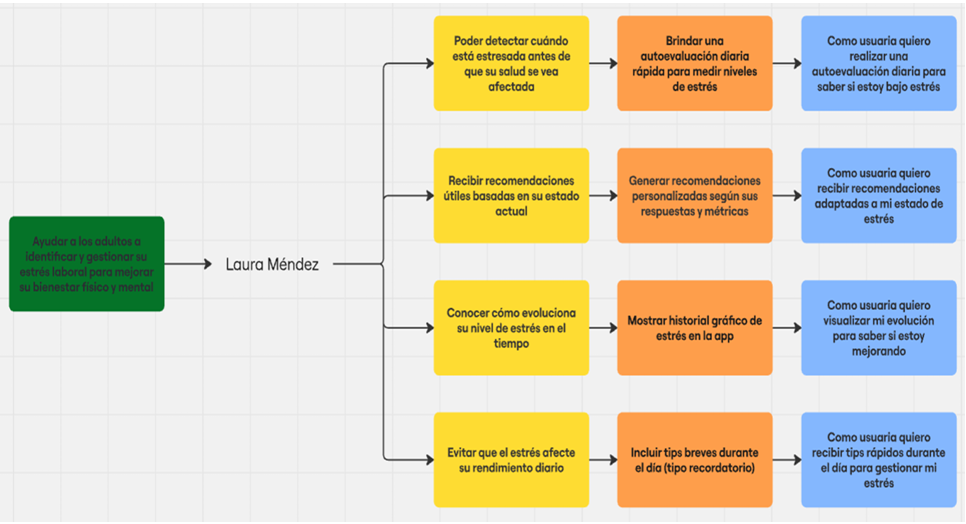

Impact Mapping - Segmento 2

  
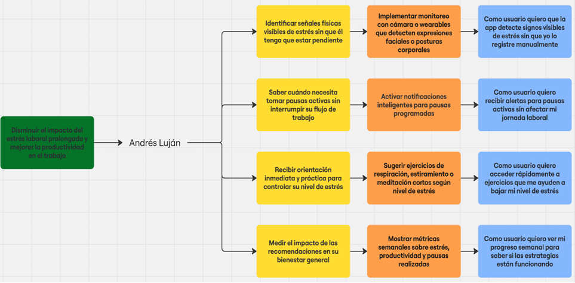

---

## 3.4. Product Backlog

| Prioridad | User Story ID | Título HU                                  | Story Points |
| --------- | ------------- | ------------------------------------------ | ------------ |
| 1         | US01          | Registrar cuenta de usuario                | 3            |
| 2         | US02          | Configurar perfil biométrico               | 5            |
| 3         | US03          | Completar cuestionario inicial de salud    | 3            |
| 4         | US04          | Realizar test de autoevaluación de estrés  | 5            |
| 5         | US05          | Análisis biométrico de señales de estrés   | 8            |
| 6         | US06          | Registro de síntomas físicos               | 3            |
| 7         | US07          | Recibir recomendaciones personalizadas     | 5            |
| 8         | US08          | Realizar ejercicios de respiración guiados | 3            |
| 9         | US09          | Programar pausas activas laborales         | 3            |
| 10        | US10          | Visualizar dashboard personal de estrés    | 5            |
| 11        | US11          | Generar informes de progreso               | 5            |
| 12        | US12          | Registrar desencadenantes de estrés        | 3            |
| 13        | US13          | Buscar psicólogos especializados           | 3            |
| 14        | US14          | Agendar cita con psicólogo                 | 5            |
| 15        | US15          | Compartir informes con especialistas       | 3            |
| 16        | US16          | Participar en grupos de apoyo              | 3            |
| 17        | US17          | Acceder a biblioteca de recursos           | 2            |
| 18        | US18          | Participar en desafíos antiestrés          | 3            |
| 19        | US19          | Analizar carga laboral                     | 5            |
| 20        | US20          | Recibir recordatorios de ergonomía         | 2            |

---

# 4. Capítulo IV: Product Design

---

## 4.1. Style Guidelines.

NeuroDraw, dedicado a la detección rápida y manejo del estrés laboral, transmite calma, confianza y profesionalismo. Nuestra identidad visual combina tonos azules y verdes para evocar tranquilidad, con tipografía clara y espacios limpios. Comunicamos con un lenguaje accesible pero riguroso, transformando conceptos complejos de neurociencia en soluciones prácticas para el bienestar laboral.

---

### 4.1.1. General Style Guidelines.

Logo: El logo de NeuroZen fusiona elementos neurológicos y serenidad en un diseño significativo. La silueta de perfil humano en Verde Bosque muestra circuitos cerebrales que simbolizan cómo nuestra plataforma conecta ciencia y bienestar mental.

  
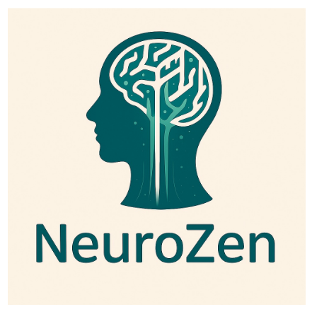

Tipografía:

La tipografía de la página debe ser fácil de leer, adaptándose al dispositivo en el que se encuentre. Para ello, se emplearán dos fuentes sans-serif (sin remates decorativos) porque son más legibles y claras. Además, el contenido mostrado debe de resaltar.

Color Guide:

1. Verde Bosque (#2D5A4A)
Representación: El verde bosque simboliza estabilidad, crecimiento y conexión con la naturaleza. En el contexto de NeuroZen, este color representa la base sólida que ofrece la plataforma para ayudar a los usuarios a manejar su estrés. Se utiliza en elementos principales como el logotipo y encabezados, transmitiendo confianza y un ambiente relajante que invita a la calma mental.

  
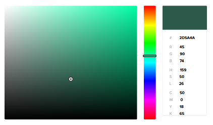

2. Verde Menta (#A2C4B5)
Representación: El verde menta evoca frescura, renovación y claridad mental. Este color más suave complementa al verde bosque y se utiliza en áreas secundarias de la plataforma. Representa la sensación refrescante que experimentan los usuarios al reducir su estrés mediante las técnicas proporcionadas por NeuroZen, creando un ambiente digital que respira tranquilidad.

  
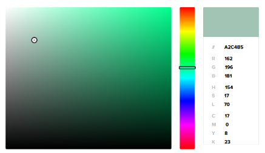

3. Beige Cálido (#F1E9D4)
Representación: El beige cálido transmite neutralidad, confort y serenidad. En NeuroZen, este color se utiliza para fondos y espacios de descanso visual, proporcionando un ambiente acogedor que reduce la fatiga visual durante las sesiones de meditación o ejercicios anti-estrés. El beige crea un entorno digital que se siente como un refugio seguro.

  
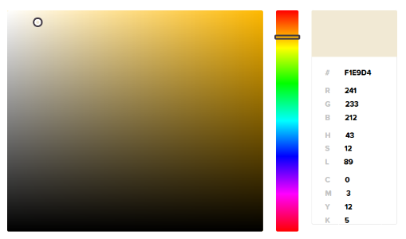

4. Turquesa Profundo (#1A6F78)
Representación: El turquesa profundo simboliza la profundidad emocional, la comunicación y la sabiduría. Este color representa el componente científico y psicológico de NeuroZen, destacando las herramientas basadas en evidencia para el manejo del estrés. Se utiliza en elementos interactivos y botones de acción, invitando a los usuarios a explorar soluciones más profundas.

  
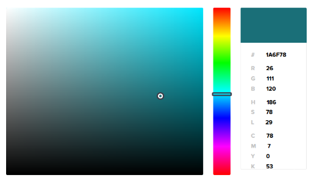

5. Gris Piedra (#8C9893)
Representación: El gris piedra evoca neutralidad, equilibrio y estabilidad. En NeuroZen, este color funciona como un ancla visual que equilibra los verdes y turquesas más expresivos. Se utiliza para texto secundario y elementos de interfaz sutiles, aportando sofisticación sin competir con los colores principales que transmiten calma y bienestar.

  
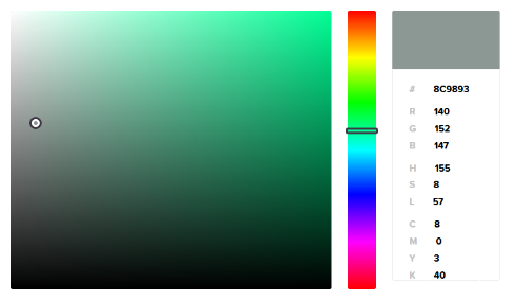

La paleta de colores de NeuroZen combina verdes y turquesas para transmitir naturaleza y tecnología, beige para crear un entorno acogedor y gris piedra para aportar profesionalismo. En conjunto, el diseño busca generar una experiencia visual relajante y coherente con la misión de reducir el estrés del usuario.

Buttons:

La plataforma NeuroZen para control del estrés presenta una interfaz intuitiva con botones fácilmente identificables en toda la experiencia. Los botones principales utilizan Verde Bosque (#2D5A4A) para acciones importantes como iniciar meditaciones, mientras que los secundarios aparecen en Verde Menta (#A2C4B5), creando jerarquía visual. El fondo en Beige Cálido (#F1E9D4) proporciona un ambiente relajante, complementado por elementos interactivos en Turquesa Profundo (#1A6F78) para funciones especiales y Gris Piedra (#8C9893) para textos y detalles sutiles. Todos los botones tienen formas redondeadas y tamaños generosos, facilitando su uso incluso en momentos de estrés, mientras que los estados de hover y feedback ofrecen respuestas visuales claras que refuerzan la sensación de calma y control que define la experiencia de NeuroZen.

Variaciones del logo en diferentes representaciones:

  
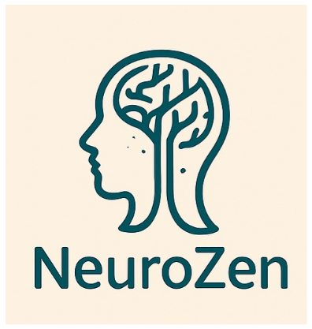

-Una opción minimalista, sin muchos detalles y relajante a la vista.

  
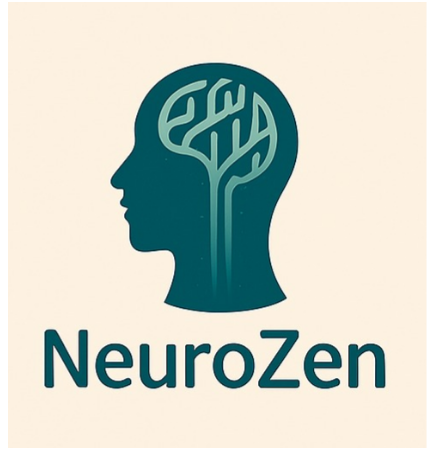

-Una opción con mejor detalle y uso de colores.

  
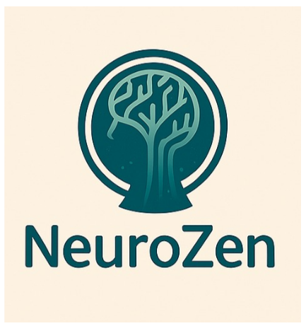

-Una representación más abstracta que inspira relajación.

  
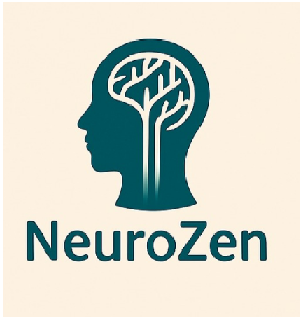

-Una opción que combina las dos primeras ideas.

---

### 4.1.2. Web Style Guidelines.

Para NeuroZen, estamos desarrollando una plataforma web y una landing page enfocada en el bienestar laboral. Por ello, implementaremos un diseño adaptable (Web Responsive Design) que optimice la presentación de la información en cualquier dispositivo, ya sea computadora, tablet o smartphone. Esto garantizará que el contenido sea accesible y claro en todo momento, mejorando la experiencia de los usuarios.

Como equipo, hemos decidido incorporar el patrón de diseño en forma de Z para la página principal. Esta técnica es ideal para dirigir la atención de los visitantes hacia los elementos más importantes de NeuroZen, como el objetivo del proyecto, el acceso al test de estrés y los beneficios de la plataforma. Colocaremos el logotipo de NeuroZen en la esquina superior izquierda para reforzar el reconocimiento de marca, mientras que en la esquina superior derecha estará la barra de navegación y un botón de llamado a la acción destacado que invite a registrarse o probar el test inicial.

---

## 4.2. Information Architecture.

NeuroZen detecta el estrés laboral combinando datos biométricos (postura, tensión facial, respiración) con autoevaluaciones emocionales para generar un perfil de estrés personalizado. La app ofrece recomendaciones y ejercicios para reducir los síntomas, envía notificaciones en tiempo real ante aumentos de estrés y permite revisar un historial de tendencias para identificar patrones.

A futuro, se integrará con psicólogos y programas de bienestar laboral para empresas, convirtiéndose en una herramienta completa de prevención y gestión del estrés.

---

### 4.2.1. Organization Systems

La información se organiza de forma lógica para que el usuario encuentre rápido lo que necesita:

Estructura basada en módulos claros: inicio, autoevaluación, recomendaciones, profesionales, comunidad y recursos.

Jerarquización de contenidos: lo más usado (tests y recomendaciones) aparece en posiciones destacadas.

---

### 4.2.2. Labeling Systems

El etiquetado debe ser claro, breve y familiar para los usuarios:

Uso de términos simples como: Inicio, Test de Estrés, Recomendaciones, Comunidad, Psicólogos, Recursos.

Evitar tecnicismos clínicos, priorizando un lenguaje cotidiano.

Consistencia en los nombres en toda la app y web.

---

### 4.2.3. SEO Tags and Meta Tags

Meta títulos: deben incluir palabras clave relacionadas con salud mental, estrés laboral y bienestar.

Meta descripciones: claras, con llamado a la acción (ejemplo: “Evalúa tu nivel de estrés y recibe recomendaciones personalizadas”).

Etiquetas alt en imágenes con descripciones concisas.

Uso de headings (H1, H2, H3) para mejorar la indexación en buscadores.

---

### 4.2.4. Searching Systems

Búsqueda interna intuitiva, con autocompletado y sugerencias rápidas.

Posibilidad de filtrar resultados (ejemplo: artículos, psicólogos, recursos, ejercicios).

Optimización para resultados relevantes según la necesidad del usuario.

---

### 4.2.5. Navigation Systems

Menú principal: siempre visible, con las secciones clave (Inicio, Autoevaluación, Recomendaciones, Comunidad, Contacto).

Breadcrumbs para indicar dónde se encuentra el usuario.

CTA (Call To Action) claros y visibles, guiando al usuario hacia las acciones más importantes (hacer test, contactar especialista, unirse a un grupo).

Compatibilidad responsive, manteniendo la navegación fluida en móviles y escritorio.

---

## 4.3. Landing Page UI Design.

El diseño de la interfaz de usuario para la landing page de NeuroZen será un elemento clave, ya que representará la primera impresión que recibirán los usuarios sobre la aplicación. Su objetivo es ofrecer una experiencia visual atractiva y fácil de usar que despierte el interés de los visitantes y los motive a conocer más sobre las funciones de la plataforma.

---

### 4.3.1. Landing Page Wireframe.

Los Wireframes de la página son una versión simplificada de la manera en la que se organizará la información. Se hace una organización de la estructura visual de todos los componentes previo a centrarse en la parte visual de la página. Gracias a esto, podemos observar que cosas se necesitan cambiar si fuera necesario, agilizando el tiempo de organizar los datos.

  
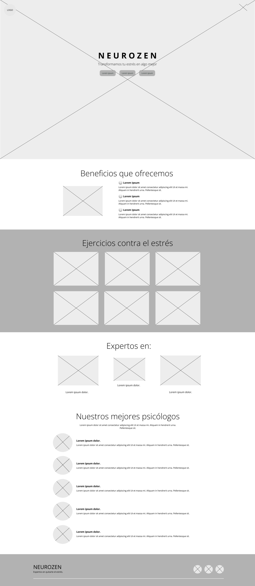

  

  
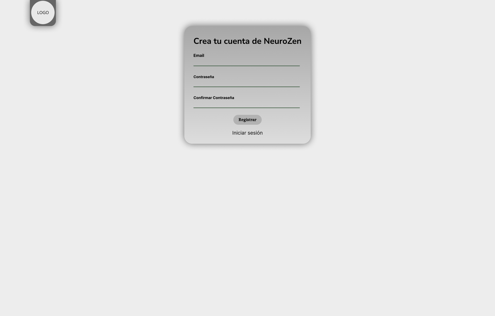

  

Nuestro Landing Page:

[● Link: https://neurozen-org.github.io/NeuroZen-landing](https://neurozen-org.github.io/NeuroZen-landing)

---

### 4.3.2. Landing Page Mock-up.

Un mockup es una representación visual de un producto que muestra cómo lucirá, a diferencia de un wireframe, que se enfoca en la estructura. Aunque no es interactivo, puede ser de media o alta fidelidad y ayuda a tomar decisiones finales sobre aspectos como esquemas de colores, estilo visual y tipografía. Es una herramienta valiosa en el proceso de diseño para alinear expectativas y obtener retroalimentación antes de la implementación.

  
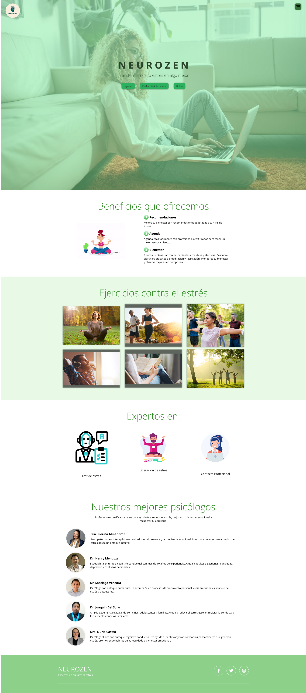

  

  
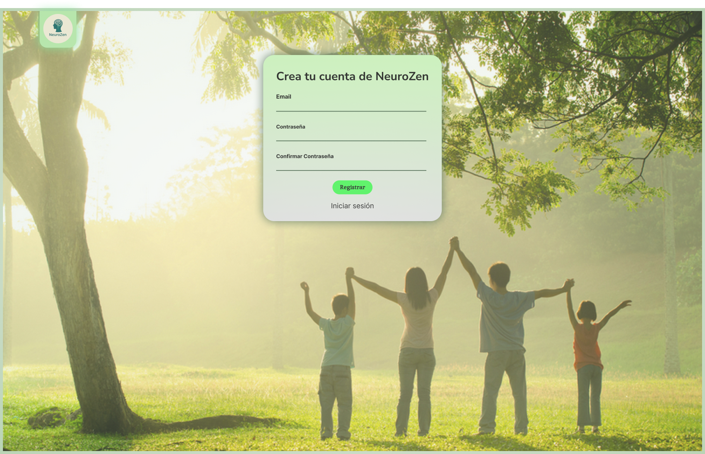

  
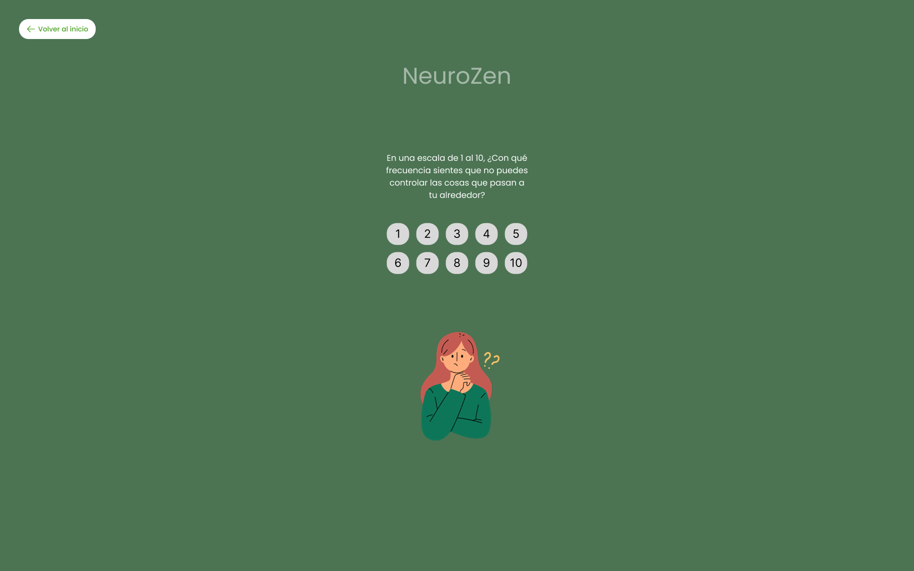

---

## 4.4. Web Applications UX/UI Design.

El diseño de experiencia de usuario (UX) y de interfaz de usuario (UI) busca ofrecer una interacción digital clara, sencilla y motivadora. La UX se enfoca en entender las necesidades de las personas que buscan manejar su estrés y en crear flujos que les permitan registrar sus datos, evaluar su estado y recibir recomendaciones de forma rápida. La UI complementa esta experiencia con un diseño visual relajante y ordenado, usando colores, íconos y botones que transmiten calma y profesionalismo. Al combinar funcionalidad intuitiva con una estética agradable, se logra que el usuario se sienta acompañado y en control de su bienestar.

---

### 4.4.1. Web Applications Wireframes.

Los wireframes representan la estructura básica de las pantallas clave de la aplicación web, evidenciando la aplicación de principios de simplicidad, consistencia visual y accesibilidad.

- **Wireframe – Login**

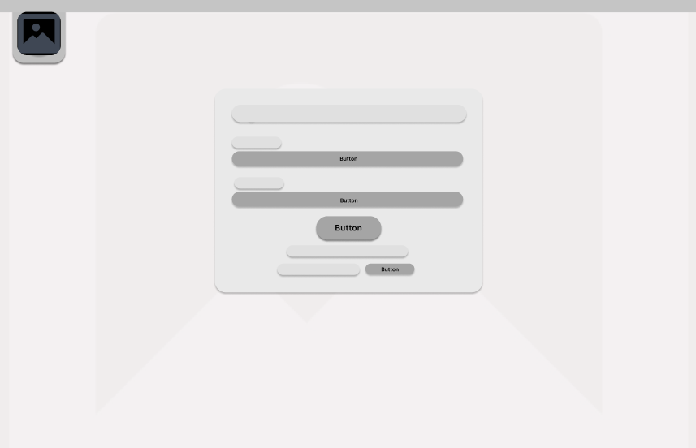

- **Wireframe – Register**

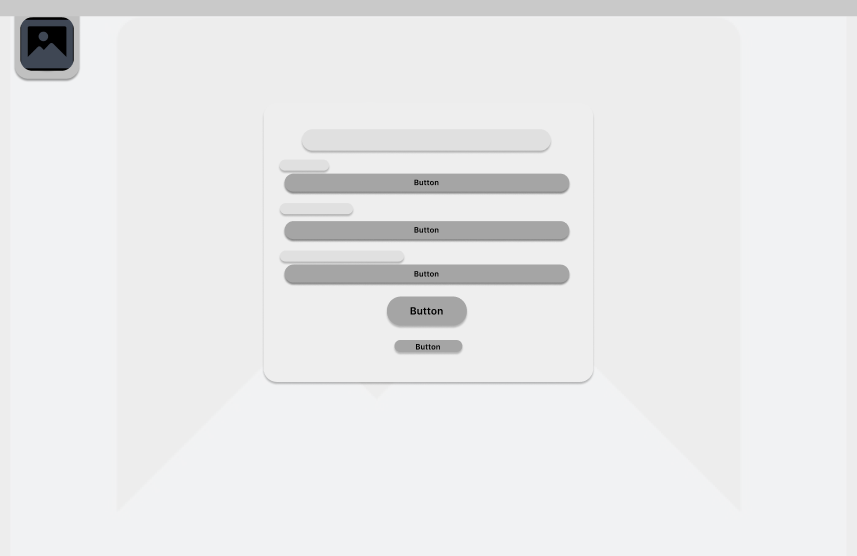

- **Wireframe – Landing Page**

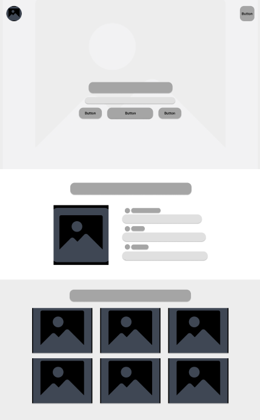

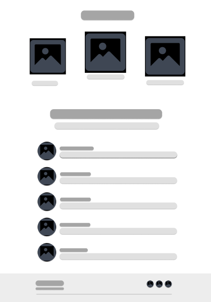

- **Wireframe – Test**

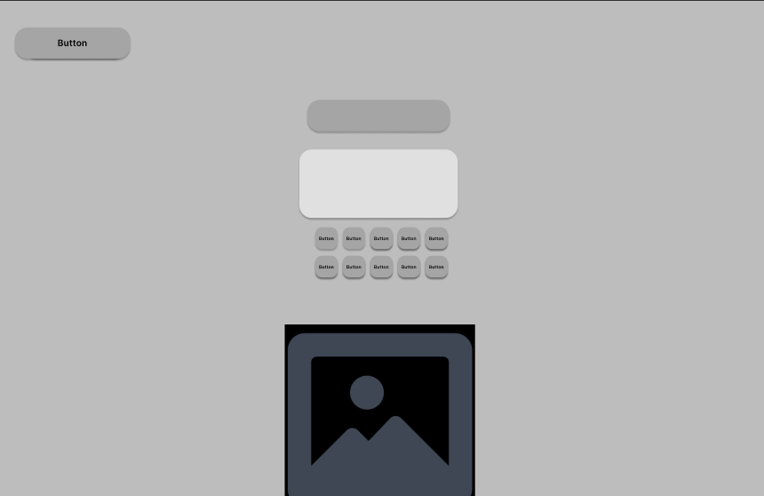

- **Wireframe – Menú**

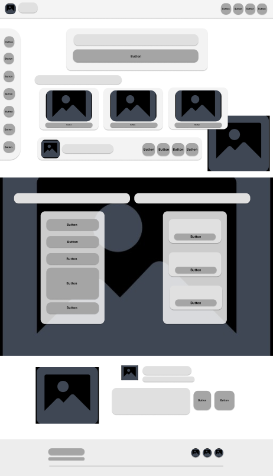

- **Wireframe – Recommended Activity**

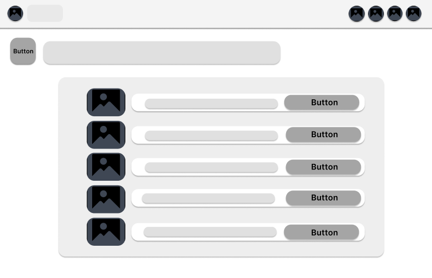

- **Wireframe – Professional Contact**

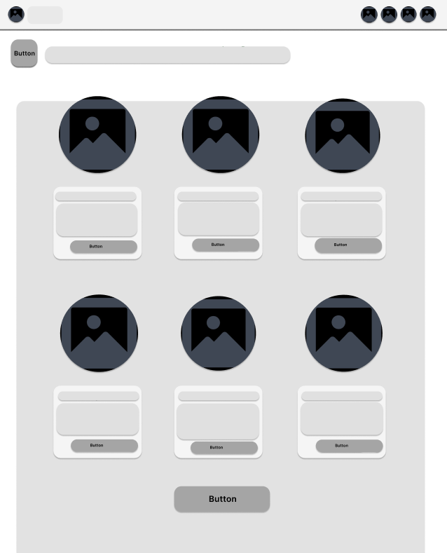

- **Wireframe – Profile**

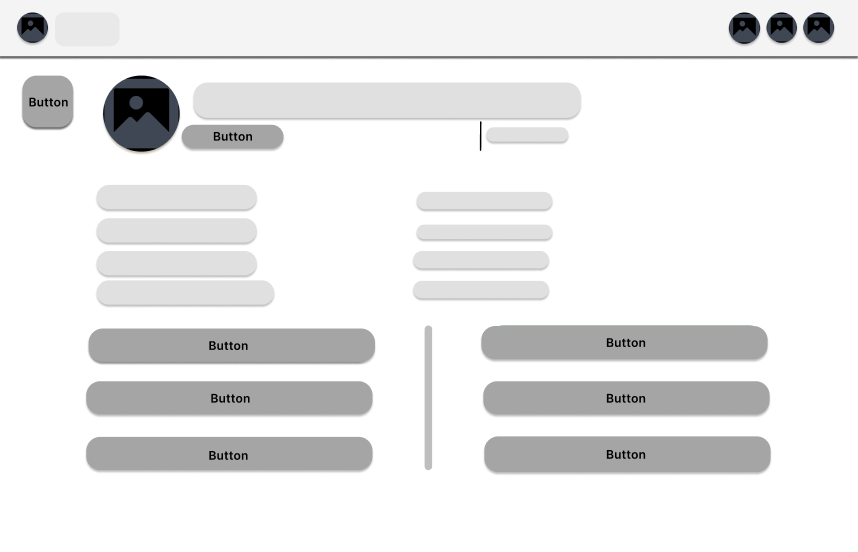

- **Wireframe – Zen IA**

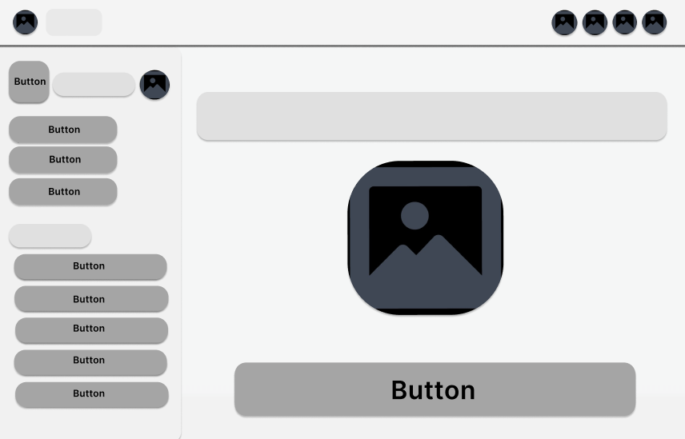

- **Wireframe – Selected Activity**

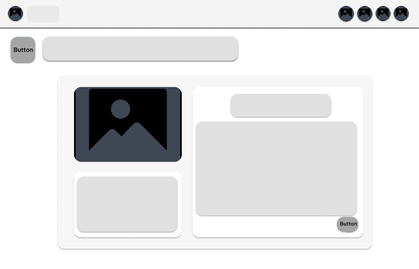

- **Wireframe – Favorites**

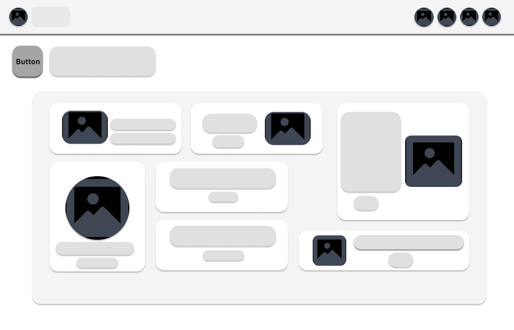

- **Wireframe – Planes**

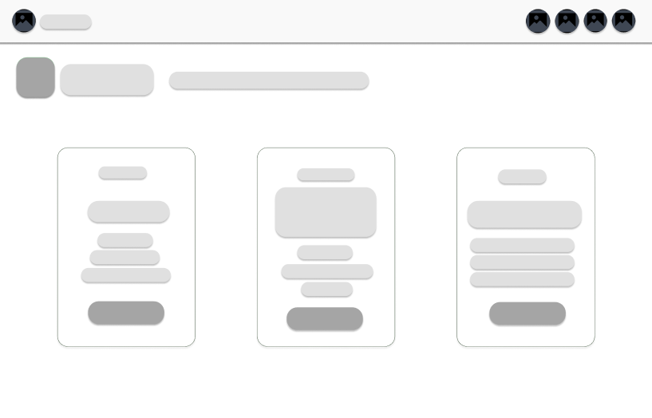

---

### 4.4.2. Web Applications Wireflow Diagrams.

Los wireflows ilustran cómo se enlazan los wireframes a través de interacciones típicas de los usuarios (User Goals). En este caso, el flujo refleja el proceso de acceso al landing page → registro → inicio de sesión → acceso al menú → entrada a las funcionalidades de NeuroZen.

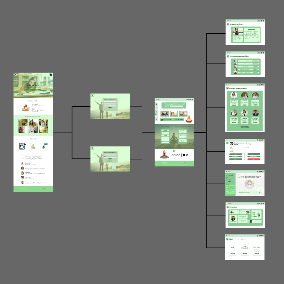

---

### 4.4.3. Web Applications Mock-ups.

Los mock-ups muestran la versión visual detallada de las pantallas, aplicando la identidad visual de NeuroZen (colores, tipografías y estilos inclusivos). Aquí se evidencian las decisiones finales de diseño.

- **Wireframe – Login**

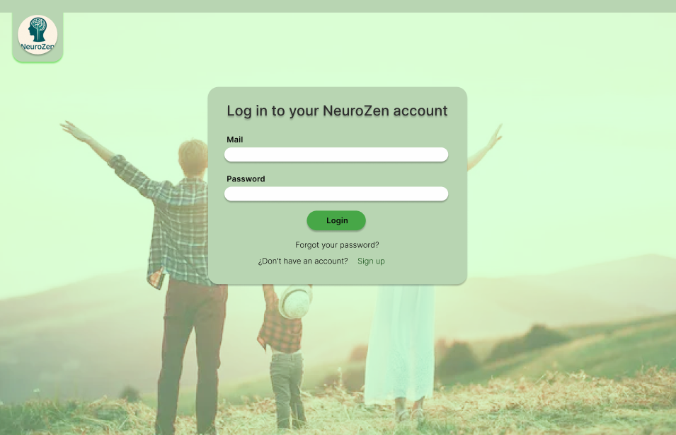

- **Wireframe – Register**

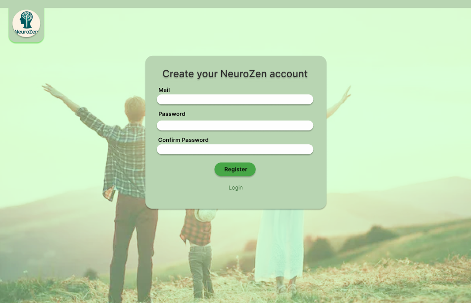

- **Wireframe – Landing Page**

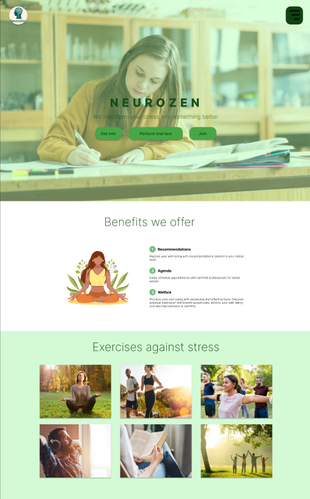


- **Wireframe – Test**


- **Wireframe – Menú**


- **Wireframe – Recommended Activity**


- **Wireframe – Professional Contact**


- **Wireframe – Profile**


- **Wireframe – Zen IA**


- **Wireframe – Selected Activity**


- **Wireframe – Favorites**


- **Wireframe – Planes**


---

### 4.4.4. Web Applications User Flow Diagrams.

Los **User Flow Diagrams** representan los caminos que siguen los usuarios dentro de la aplicación para cumplir sus objetivos.  
Estos flujos integran los **mock-ups** y los **wireflows**, mostrando tanto la ruta esperada (**happy path**) como las rutas alternativas en caso de error (**unhappy path**).

A continuación, presentamos los principales **User Goals** identificados y sus respectivos flujos:

---

#### User Flow 1: Registro de nuevo usuario

| **Elemento**               | **Descripción**                                                                                                                       |
| -------------------------- | ------------------------------------------------------------------------------------------------------------------------------------- |
| **User Goal**              | Crear una cuenta en la plataforma para acceder a las funcionalidades de NeuroZen.                                                     |
| **Happy Path**             | El usuario ingresa su correo, contraseña y confirmación → Presiona **Registrarse** → Recibe confirmación → Redirige al **login**.     |
| **Unhappy Path**           | El usuario deja campos vacíos o ingresa una contraseña inválida → El sistema muestra mensajes de error sin avanzar al siguiente paso. |
| **Pantallas involucradas** | Wireframe **Register** → **Login**.                                                                                                   |
| **Usuario Destinado**      | Usuario nuevo.                                                                                                                        |

---

#### User Flow 2: Inicio de sesión

| **Elemento**               | **Descripción**                                                                                              |
| -------------------------- | ------------------------------------------------------------------------------------------------------------ |
| **User Goal**              | Acceder a la plataforma con credenciales válidas para usar las herramientas.                                 |
| **Happy Path**             | El usuario ingresa correo y contraseña válidos → Presiona **Iniciar Sesión** → Accede a la **Landing Page**. |
| **Unhappy Path**           | Contraseña incorrecta o email inválido → Se muestra error y se mantiene en la misma pantalla.                |
| **Pantallas involucradas** | Wireframe **Login** → **Landing Page**.                                                                      |
| **Usuario Destinado**      | Usuario recurrente.                                                                                          |

---

#### User Flow 3: Exploración de la Landing Page

| **Elemento**               | **Descripción**                                                                                                                    |
| -------------------------- | ---------------------------------------------------------------------------------------------------------------------------------- |
| **User Goal**              | Navegar por los beneficios, ejercicios y lista de psicólogos ofrecidos por NeuroZen.                                               |
| **Happy Path**             | Desde la **Landing Page** el usuario accede a secciones: **Beneficios**, **Ejercicios contra el estrés**, **Nuestros psicólogos**. |
| **Unhappy Path**           | El usuario no logra encontrar la sección buscada → Recurre al menú principal para reorientarse.                                    |
| **Pantallas involucradas** | **Landing Page** (mock-up).                                                                                                        |
| **Usuario Destinado**      | Usuarios registrados y no registrados.                                                                                             |

---

#### User Flow 4: Contacto con psicólogos

| **Elemento**               | **Descripción**                                                                                               |
| -------------------------- | ------------------------------------------------------------------------------------------------------------- |
| **User Goal**              | Conectarse con un psicólogo desde la sección “Nuestros mejores psicólogos”.                                   |
| **Happy Path**             | El usuario selecciona un psicólogo → Accede a la ficha → Obtiene información de contacto o agenda una sesión. |
| **Unhappy Path**           | El sistema no carga la información del psicólogo → El usuario recibe un mensaje de error.                     |
| **Pantallas involucradas** | **Landing Page** → **Sección Psicólogos**.                                                                    |
| **Usuario Destinado**      | Usuarios interesados en asesoría profesional.                                                                 |

---

## 4.5. Web Applications Prototyping.

#### Introducción

En esta sección se presentan los prototipos interactivos de la aplicación **NeuroZen**, diseñados tanto para desktop como para mobile web browser.  
Estos prototipos simulan la navegación y los principales flujos de interacción, basados en los **User Flow Diagrams** previamente definidos.

---

#### Criterios de Diseño

Los criterios principales que guiaron las decisiones de interacción fueron:

- **Consistencia con la arquitectura de información:** se respetan los sistemas de organización, etiquetado, búsqueda y navegación definidos en la sección 4.2.
- **Usabilidad e inclusión:** se priorizó un diseño simple, accesible y claro, de manera que los usuarios puedan completar sus objetivos (registro, login, realización del test de estrés, contacto con psicólogos) sin fricciones.
- **Coherencia visual:** los prototipos mantienen el sistema de diseño propuesto en los mock-ups, con tipografía, colores y componentes reutilizables para garantizar uniformidad.

---

#### Prototipo Desktop

Los prototipos de escritorio muestran los siguientes flujos clave:

- Registro de usuario.
- Login de usuario.
- Acceso al landing page con los beneficios y secciones informativas.
- Exploración de secciones de ejercicios y psicólogos.

**Screenshot de ejemplo (Desktop):**


---

#### Prototipo Mobile

Los prototipos móviles priorizan la navegación simplificada en pantallas pequeñas, asegurando la accesibilidad de todas las funciones principales:

- Registro e inicio de sesión adaptados a mobile.
- Visualización compacta de los beneficios y ejercicios contra el estrés.
- Sección de psicólogos optimizada en tarjetas verticales.
- Navegación a través del menú hamburguesa.

**Screenshot de ejemplo (Mobile):**


---

#### Conexión con los User Flow Diagrams

Los prototipos presentados corresponden directamente a los **User Flows** definidos en la sección 4.4:

- Registro de usuario.
- Inicio de sesión.
- Acceso al landing page.
- Contacto con psicólogos.

---

## 4.6. Domain-Driven Software Architecture.

La arquitectura de software orientada al dominio es un enfoque de diseño que se centra en la estructura y organización del software en torno a los conceptos y procesos clave de un dominio específico. Este enfoque nos permite crear sistemas que reflejen con precisión los requisitos y la lógica del negocio, lo que facilita la implementación de funcionalidades específicas y la adaptación a los cambios en el dominio. Con NeuroZen, utilizamos una arquitectura de software orientada al dominio para estructurar nuestro sistema de manera coherente y escalable, lo que nos permitirá desarrollar una aplicación robusta y fácil de mantener.

---

### 4.6.1. Design-Level EventStorming.

#### Objetivo de la Sesión

**Objetivo:**  
Estructurar el dominio en contextos claros, detallar el flujo principal (**test de estrés → recomendaciones → contacto profesional**)  
y los cruces entre contextos (**suscripciones, notificaciones**).

---

#### Captura de la Sesión:


#### Bounded Contexts

- **Identity & Access (IAM):** registro, login, autorización.
- **Profiles & Preferences:** datos del usuario, preferencias de bienestar.
- **Stress Test & Support:** sesiones de test, cálculo de score, planes sugeridos.
- **Recommendations & Activities:** asignación y seguimiento de actividades.
- **Professionals Directory:** psicólogos, solicitud de contacto.
- **Subscriptions & Payments:** suscripciones y cobros.
- **Notifications:** correos/push transaccionales.
- **Analytics & Reporting:** métricas de uso y progreso.

---

#### Aggregates, Commands, Events, Queries (Resumen)

- **User:**

  - **Commands:** `RegisterUser`, `LoginUser`
  - **Events:** `UserRegistered`, `LoginSucceeded` / `LoginFailed`
  - **Queries:** `GetUserProfile`

- **Profile:**

  - **Commands:** `UpdateProfile`
  - **Events:** `ProfileUpdated`
  - **Queries:** `GetProfile`

- **TestSession:**

  - **Commands:** `StartTest`, `SubmitAnswers`
  - **Events:** `TestSubmitted`, `StressScoreCalculated`
  - **Queries:** `GetLastScore`

- **Plan/Activities:**

  - **Commands:** `AssignActivities`
  - **Events:** `ActivitiesAssigned`
  - **Queries:** `GetActivities`

- **Psychologist:**

  - **Commands:** `CreateProProfile`, `RequestContact`
  - **Events:** `PsychologistPublished`, `PsychologistContactRequested`
  - **Queries:** `FindPsychologists`

- **Subscription:**

  - **Commands:** `StartSubscription`, `ProcessPayment`
  - **Events:** `SubscriptionActivated`, `PaymentProcessed` / `PaymentFailed`
  - **Queries:** `GetSubscriptionStatus`

- **Notification:**
  - **Commands:** `SendEmail`, `Push`
  - **Events:** `EmailSent`, `PushSent`
  - **Queries:** `GetDeliveryStatus`

---

#### Flujo Principal (Happy Path)

1. Usuario inicia test → registra respuestas → se calcula **score**.
2. Si el **score** supera el umbral → se asignan actividades y se notifica por email/push.
3. El usuario puede solicitar contacto con un psicólogo.

---

### 4.6.2. Software Architecture Context Level Diagram.

**Descripción:**  
El sistema **NeuroZen** está al centro y muestra su relación con actores humanos y sistemas externos (pagos, correo, contenidos de ejercicios).

---

#### Diagrama


---

#### Explicación

- **Actores:**

  - Paciente/Usuario
  - Psicólogo
  - Administrador

- **Sistemas externos:**

  - Pasarela de pagos
  - Servicio de correo (SMTP/Provider)
  - API de ejercicios/meditación

- **Interacciones clave:**
  - Los usuarios interactúan con **NeuroZen**.
  - La plataforma se integra con servicios externos para pagos, notificaciones y contenidos.

---

### 4.6.3. Software Architecture Container Level Diagram.

**Descripción:**  
Elementos de alto nivel, responsabilidades y comunicaciones entre contenedores de **NeuroZen**.

**Diagrama**


---

#### Contenedores y Decisiones Tecnológicas

- **Web Frontend (HTML/CSS/JS):** interfaz para landing, login/registro, test, actividades y directorio de psicólogos.
- **Backend API (Node.js/Express):** lógica de dominio; expone endpoints REST.
- **MongoDB:** persistencia (usuarios, sesiones de test, actividades, psicólogos, suscripciones).
- **Auth Service (JWT/OAuth2):** autenticación/autorización.
- **Notifications (Email/Push):** envíos transaccionales.
- **Redis (opcional):** cache para sesiones/resultados.
- **Integraciones:** pasarela de pagos, API de ejercicios, SMTP/Provider.

---

#### Comunicación

- **Frontend ↔ Backend:** comunicación vía REST.
- **Backend →** Auth / Notifications / DB / Redis.
- **Backend →** pasarela de pagos, API de ejercicios y SMTP vía adaptadores.

### 4.6.4. Software Architecture Component Level Diagrams

#### 4.6.4.1. Backend API.

#### Diagrama


#### Componentes y Responsabilidades

- **API Gateway / Router:** roteo de endpoints, validación básica.
- **Users Module:** registro, login, refresh token, gestión de roles.
- **Profiles Module:** CRUD de perfil y preferencias.
- **Test & Assessment Module:** inicio/guardado de respuestas, cálculo de score.
- **Recommendations Module:** asignación/listado de actividades, progreso.
- **Professionals Module:** directorio/búsqueda de psicólogos, solicitud de contacto.
- **Subscriptions & Payments Module:** planes, checkout, webhooks de pago.
- **Notifications Module:** cola y envío de correos/push.
- **Analytics Module:** métricas, reporting.

---

#### Interacciones Internas Relevantes

- **Test & Assessment → Recommendations:** asignación en base al score.
- **Subscriptions & Payments → Notifications:** confirmaciones/recordatorios.
- **Recommendations → Notifications:** envío de plan.

---

#### 4.6.4.1. Frontend Web.

#### Diagrama


---

#### Vistas / Componentes

- **Header & Navigation:** navegación global (desktop/mobile).
- **Landing/Home:** beneficios, ejercicios destacados, psicólogos.
- **Auth (Login/Registro):** formularios, validaciones, almacenamiento de token.
- **Stress Test UI:** formulario del test, feedback de score.
- **Activities & Exercises:** plan sugerido, tarjetas de ejercicios.
- **Psychologists Directory:** ficha/listado de profesionales.
- **User Profile:** datos y preferencias.
- **UI Kit / Shared Components:** botones, inputs, tarjetas, modales, toasts.

---

#### Notas de Implementación

- **Accesibilidad:** labels, foco visible, contraste AA/AAA.
- **Estado y persistencia ligera:** almacenamiento en **Storage** para token.
- **Rutas:** `/`, `/login`, `/registro`, `/test`, `/actividades`, `/psicologos`, `/perfil`.

---

## 4.7. Software Object-Oriented Design.

En esta sección se muestran y describen los **diagramas de clases** que detallan la implementación de los componentes en cada _bounded context_.

La propuesta incluye las **clases, interfaces y enumeraciones**, junto con sus relaciones.  
Se representan los **atributos, métodos y niveles de visibilidad** (public, private, protected).  
Además, se indican las **multiplicidades y asociaciones** entre clases, garantizando que estén alineadas con los _bounded contexts_ definidos anteriormente.

---

### 4.7.1. Class Diagrams.


---

### 4.7.2. Class Dictionary.

A continuación se describe cada clase y sus atributos:

**Clase: User**
Representa a los usuarios de la aplicación

| Atributo | Tipo de dato | Descripción                     |
| -------- | ------------ | ------------------------------- |
| id       | int          | Identificador único del usuario |
| name     | string       | Nombre del usuario              |
| email    | string       | Correo electrónico registrado   |
| password | string       | Contraseña de acceso            |
| role     | string       | Rol del usuario (user, admin)   |

**Clase: Psychologist**
Especialista que puede agendar sesiones con usuarios.

| Atributo  | Tipo de dato | Descripción                       |
| --------- | ------------ | --------------------------------- |
| id        | int          | Identificador único del psicólogo |
| name      | string       | Nombre completo                   |
| specialty | string       | Área de especialidad              |
| email     | string       | Correo electrónico                |
| phone     | string       | Número de contacto                |

**Clase: CheckIn**
Registro de los niveles de estrés de los usuarios

| Atributo | Tipo de dato | Descripción                                      |
| -------- | ------------ | ------------------------------------------------ |
| id       | int          | Identificador único del check-in                 |
| userId   | int          | Referencia al usuario                            |
| date     | DateTime     | Fecha y hora del check-in                        |
| mood     | string       | Estado del usuario (Calm, Stressed, Overwhelmed) |
| notes    | string       | Observaciones adicionales                        |

**Clase: Plan**
Planes personalizados de bienestar asignados a los usuarios

| Atributo    | Tipo de dato | Descripción                         |
| ----------- | ------------ | ----------------------------------- |
| id          | int          | Identificador del plan              |
| userId      | int          | Referencia al usuario               |
| title       | string       | Nombre del plan                     |
| description | string       | Detalles del plan                   |
| duration    | int          | Duración en días                    |
| status      | string       | Estado del plan (Active, Completed) |

**Clase: Notification**
Notificaciones enviadas a los usuarios para recordatorios o alertas

| Atributo | Tipo de dato | Descripción                            |
| -------- | ------------ | -------------------------------------- |
| id       | int          | Identificador único de la notificación |
| userId   | int          | Referencia al usuario                  |
| message  | string       | Contenido de la notificación           |
| sentAt   | DateTime     | Fecha y hora de envío                  |
| read     | boolean      | Indica si fue leída                    |

**Clase: Session**
Registra citas agendadas con psicólogos

| Atributo       | Tipo de dato | Descripción                                           |
| -------------- | ------------ | ----------------------------------------------------- |
| id             | int          | Identificador único de la sesión                      |
| userId         | int          | Referencia al usuario                                 |
| psychologistId | int          | Referencia al psicólogo                               |
| scheduledAt    | DateTime     | Fecha y hora programada                               |
| status         | string       | Estado de la sesión (Scheduled, Completed, Cancelled) |

---

## 4.8. Database Design.

---

### 4.8.1. Database Diagram.


---

# 5. Capítulo V: Product Implementation, Validation & Deployment

En esta sección se mencionan las decisiones y convenciones las cuales permitirán mantener una consistencia durante el desarrollo del proyecto.

### 5.1.1 Software Development Environment Configuration

**Project Management:**

La gestión de los proyectos tiene como objetivo mejorar los procesos y su entorno para alcanzar los resultados esperados.

- **Trello:** Es una herramienta visual que permite gestionar cualquier tipo de proyecto y el flujo de trabajo que el equipo desarrollador seguirá para implementar correctamente las tareas de código para el Landing Page y el web Application.

<table>
    <tbody>
        <tr>
            <td>Link de referencia: </td>
            <td>https://trello.com/es </td>
        </tr>
    </tbody>
</table>

**Requirements Management:**

Es el proceso de garantizar que una organización documente verifique y satisfaga las necesidades, expectativas de sus clientes con las partes interesadas internas o externas.

- **Pivotal Tracker:** Esta herramienta se define como una plataforma en la que se realiza la gestión de user stories, agrupándolos en epics y clasificando su presencia en el programa, por puntaje. Se usó porque permite que cada miembro del equipo comparta la misma vista en tiempo real de lo que está sucediendo con cada proyecto, ya sea aportando con diferentes secciones o corrigiendo el flujo del proyecto.

<table>
    <tbody>
        <tr>
            <td>Link de referencia: </td>
            <td>https://www.pivotaltracker.com/  </td>
        </tr>
    </tbody>
</table>

**Product UX/UI Design:**

Nos permite desarrollar el modelo en nuestro producto de manera digital y forme parte de la vida del consumidor. En este caso realizar un modelo de sitio web para computadoras y celulares.

- **Uxpressia:** es una herramienta en línea para el mapeo de la trayectoria del cliente que crea mapas de impacto y personas. Sus herramientas nos permitieron establecer las bases del modelado de User Persona, Empathy Map y Journey Map

<table>
    <tbody>
        <tr>
            <td>Link de referencia: </td>
            <td>https://uxpressia.com/ </td>
        </tr>
    </tbody>
</table>

- **MIRO:** es una pizarra digital colaborativa en línea, que puede ser usada para la investigación, la ideación, la creación de lluvias de ideas, mapas mentales y una variedad de otras actividades colaborativas.

<table>
    <tbody>
        <tr>
            <td>Link de referencia: </td>
            <td>https://www.miro.com/</td>
        </tr>
    </tbody>
</table>

- **Figma:** es una herramienta de prototipo web y editor de gráficos vectorial, que, a diferencia de las otras herramientas, se aloja en la web, permitiendo establecer los modelos para versión en Web Browser y Landing Page.

<table>
    <tbody>
        <tr>
            <td>Link de referencia: </td>
            <td>https://www.figma.com/ </td>
        </tr>
    </tbody>
</table>

- **LucidChart:** es una herramienta de diagramación basada en la web, que permite a los usuarios colaborar y trabajar juntos en tiempo real, creando diseños UML, mapas mentales, prototipos de software y muchos otros tipos de diagrama.

<table>
    <tbody>
        <tr>
            <td>Link de referencia: </td>
            <td>https://www.lucidchart.com </td>
        </tr>
    </tbody>
</table>

- **Structurizr:** es una herramienta de diseño que soporta el modelo C4, para visualizar la arquitectura de software de nuestra solución.

<table>
    <tbody>
        <tr>
            <td>Link de referencia: </td>
            <td>https://structurizr.com/ </td>
        </tr>
    </tbody>
</table>

**Software Development:**

Es una estructura aplicada al desarrollo de un producto de software. Se utiliza para el establecimiento de un proceso para el desarrollo de software, cada uno de los cuales describe un enfoque diferente para diferentes actividades que tienen lugar durante el proceso.

- **Github:** Es un repositorio comunitario cuya función es almacenar los avances de un proyecto elaborado por un grupo de personas.

<table>
    <tbody>
        <tr>
            <td>Link de referencia: </td>
            <td> https://github.com/  </td>
        </tr>
    </tbody>
</table>

- **WebStorm:** Es un entorno de JetBrains, empresa desarrolladora de Software. Este nos ofrece facilidad en probar nuestro entorno web en navegadores web. Para el proyecto se implementará la ayuda de los lenguajes HTML, CSS y TypeScript.

<table>
    <tbody>
        <tr>
            <td>Link de referencia: </td>
            <td> https://www.jetbrains.com/webstorm/ 
            </td>
        </tr>
    </tbody>
</table>

- **HTML:** Es un lenguaje que sirve como desarrollador de plataformas web que trabaja con hipertextos, que enlace a otros documentos. Este lenguaje ofrece herramientas para el diseño del sitio web.

<table>
    <tbody>
        <tr>
            <td>Link de referencia: </td>
            <td> https://www.jetbrains.com/help/webstorm/editing-html-files.html 
             </td>
        </tr>
    </tbody>
</table>

- **CSS:** Es un lenguaje de diseño para el entorno web. Permite elaborar el interfaz de usuario diseñada anteriormente, agregando colores, tamaños entre otros elementos.

<table>
    <tbody>
        <tr>
            <td>Link de referencia: </td>
            <td> https://www.jetbrains.com/help/webstorm/style-sheets.html#ws_css_completion 
             </td>
        </tr>
    </tbody>
</table>

- **TypeScript:** Es un superconjunto de JavaScript, que esencialmente añade tipos estáticos y objetos basados en clases

<table>
    <tbody>
        <tr>
            <td>Link de referencia: </td>
            <td> https://www.typescriptlang.org/ 
             </td>
        </tr>
    </tbody>
</table>

- **Angular:** Framework de TypeScript, de código abierto, utilizado para desarrollar SPA(Single Page Application).

<table>
    <tbody>
        <tr>
            <td>Link de referencia: </td>
            <td> https://angular.io  </td>
        </tr>
    </tbody>
</table>

**Software Testing:**

Es el acto de examinar los artefactos y el comportamiento del software bajo prueba mediante validación y verificación.

- **Lenguaje Gherkins:** Es un DSL o Lenguaje Específico de Dominio (Domain-Specific Language), es decir, un lenguaje que está creado para resolver un problema. Además de ser interpretado en código, se puede agregar los users stories del programa con sus respectivas partes: Feature, Scenario, Example, Scenario Outline, Given, When, Then y And.

**Software Development:**

- **Github pages:** Servicio de Github que nos permitió alojar nuestra landing page y nos permitirá alojar nuestro web applications.

<table>
    <tbody>
        <tr>
            <td>Link de referencia: </td>
            <td> https://pages.github.com/ </td>
        </tr>
    </tbody>
</table>

### 5.1.2. Source Code Management

En esta sección se presenta la gestión de código fuente o como es conocido por sus siglas en inglés SCM (Source Code Management). Su función principal es realizar un seguimiento de las modificaciones que el equipo realizará a lo largo del desarrollo de sus proyectos en los repositorios de código fuente. Se emplea como un sistema de control de versiones que permite dar seguimiento a los cambios que cada integrante o desarrollador realice en el proyecto. Asimismo, cabe resaltar que para el sistema de control de versiones emplearemos GitHub.

**GitFlow**

Es el modelo alternativo de creación de ramas en Git que en los últimos años se ha vuelto una herramienta indispensable para muchos desarrolladores. Este flujo de trabajo de control de versiones utiliza ramas y fue publicado y popularizado por Vincent Driessen. Su principal función es ayudar en la organización de la versión de un código, permitiendo la creación de nuevos Features y Hotfixes de manera organizada.

**Main Branches:**

- **main:** es la rama principal, a partir de ella se recorrerán todas las ramas y contendrá la última versión y las anteriores creadas por los desarrolladores.

- **Develop:** Esta rama puede ser creada a partir de la rama main(master) y contará con todos los Features estables. Esto significa que a través de esta rama el equipo podrá integrar las funciones.

**Support Branches:**

- **Feature:** se ramifica de developer y al finalizar debe fusionarse de nuevo en develop. Se emplea para desarrollar nuevas funciones que se integrarán en versiones posteriores.

- **Release:** también se ramifica de develop, es la rama que admite la preparación de una nueva versión de producción.

- **Hotfix:** también está destinado a una nueva versión de producción, pero esta se ramifica de main. Su función es reparar rápidamente las publicaciones de producción.

**Conventional Commits:**

Son una convención para nombrar mensajes de commit en Git de forma estructurada, clara y semántica.

- feat: Se añade una nueva funcionalidad.
- fix: Se corrige un error.
- docs: Cambios en la documentación.
- style: Cambios de formato o estilo de código (sin impacto en la lógica).
- refactor: Mejoras en el código que no añaden nuevas funcionalidades ni corrigen errores.
- test: Añadir o modificar tests.
- chore: Cambios menores sin impacto en el código de producción (actualización de dependencias, configuración, etc.).

### 5.1.4 Software Deployment Configuration

Como se mencionó previamente, la gestión de nuestro código fuente se realizará a través de GitHub. Asimismo, se utilizará GitHub Pages para la publicación y despliegue de la página.

Para el desarrollo del Landing Page de NeuroZen se han usado las siguientes herramientas:

- HTML: lenguaje con el cual está estructurado nuestro landing page.

- CSS: diseño y formato para el html desarrollado.

El despliegue de nuestro landing page es posible gracias a la herramienta de Github Pages. El cual es un servicio que nos permite alojar nuestro landing directamente desde el
repositorio de GitHub.

Para lograr el despliegue seguimos lo siguientes pasos:

1. Dirigirnos al repositorio de la página y entrar en la sección de configuración.

2. Ir a la opción de “Pages”, donde se encontrarán todas las opciones de publicación de página.

3. Se debe seleccionar la rama la cual se va a publicar en el vínculo. También se debe seleccionar la carpeta donde se localizara la publicación.

4. Finalmente, el link vínculo de nuestra página aparecerá en la parte superior.

---

## 5.2. Landing Page, Services & Applications Implementation.

La implementación de la página de inicio, los servicios y las aplicaciones es un paso fundamental en nuestro proceso de desarrollo. Nos permite materializar el diseño y la funcionalidad planificados, transformando los conceptos en productos tangibles y listos para su uso. Esta fase nos permite traducir las especificaciones y requisitos en código, desarrollando la estructura de la página, los servicios y las aplicaciones de acuerdo con las necesidades identificadas.

### 5.2.1. Sprint 1

El primer sprint es un hito importante en nuestro proceso de desarrollo ágil. Durante este período, nos enfocamos en la implementación de las características y funcionalidades prioritarias identificadas en la planificación inicial. Esto implica traducir los requisitos y especificaciones en código funcional, desarrollando las bases de nuestro producto de manera iterativa.

#### 5.2.1.1. Sprint Planning 1.

El sprint planning es una reunión en la metodología ágil donde el equipo planifica las actividades del próximo sprint. Define qué trabajo se hará, cuánto tiempo tomará y quién será responsable. El objetivo es establecer un plan claro y alcanzable para el equipo, fomentando la colaboración y asegurando que todos estén alineados en cuanto a objetivos y prioridades.

<table  style="text-align: center;">
    <tbody>
        <tr>
			<td colspan="1">Sprint #</td>
            <td colspan="1"> Sprint 1  </td>
		</tr>
        <tr>
			<td colspan="2">Sprint Planning Background </td>
		</tr>
        <tr>
			<td colspan="1">Date</td>
            <td colspan="1"> 2025-09-10 </td>
		</tr>
        <tr>
			<td colspan="1">Time</td>
            <td colspan="1"> 11:00 PM </td>
		</tr>
        <tr>
			<td colspan="1">Location</td>
            <td colspan="1">Microsoft Teams (Reunion virtual)</td>
		</tr>
        <tr>
			<td colspan="1">Prepared By</td>
            <td colspan="1"> Joao Castro </td>
		</tr>
        <tr>
			<td colspan="1"> Attendees (to planning meeting)</td>
            <td colspan="1"> Miguel Vila / Diego Requena / Joao Castro / Valentino Solis / Juan Angulo  </td>
		</tr>
         <tr>
			<td colspan="1">Sprint 1 – 1 Review Summary </td>
            <td colspan="1">Se alcanzaron los objetivos del producto como la realización de todos los capítulos, el despliegue completo de la Landing Pague y la mayoría de información necesaria dentro del reporte, sin embargo, una de las tareas/objetivos más importantes que se debía alcanzar fue la presentación de un informa en formato pdf y word.</td>
		</tr>
         <tr>
			<td colspan="1">Sprint 1 – 1 Retrospective Summary </td>
            <td colspan="1">El sprint 1 fue un poco menos productivo de lo esperado. El producto resultante no es perfecto, pero sí es funcional. Debemos realizar una mejor coordinación para los futuros trabajos.</td>
		</tr>
         <tr>
			<td colspan="2">Sprint Goal & User Stories </td>
		</tr>
         <tr>
			<td colspan="1">Sprint 1 Goal</td>
            <td colspan="1">Para este sprint se requiere el cumplimiento de los siguientes objetivos: Finalización de reporte y despliegue sin problemas de la Landing Page que se encuentran en nuestro repositorio. La métrica de cumplimiento se basará en el proceso de cómo nuestro "Board de Trello" luzca con el paso del tiempo, nuestro resultado final debe de mostrar todas las tareas en el lado derecho de la herramienta, ubicándolos en la columna "Terminado"</td>
		</tr>
        <tr>
			<td colspan="1">Sprint 1 Velocity </td>
            <td colspan="1">Para este sprint se han elegido 5 User Stories que tienen 5 Story points cada uno.</td>
		</tr>
        <tr>
			<td colspan="1">Sum of Story Points </td>
            <td colspan="1">25</td>
		</tr>
</tbody>
</table>

#### 5.2.1.2. Aspect Leaders and Collaborators.

En la primera iteración (Sprint 1), el equipo se enfocó en la **implementación de la Landing Page**, relacionada con el Epic **EP08 – Exploración como Visitante**.

#### Historias de Usuario Abordadas

| ID   | Título                                               | Descripción                                                                                                                                     | Estimación (Horas) | Asignado a | Estado |
| ---- | ---------------------------------------------------- | ----------------------------------------------------------------------------------------------------------------------------------------------- | ------------------ | ---------- | ------ |
| US25 | Explorar funcionalidades de la app sin registro      | Como visitante, quiero explorar las funcionalidades principales sin crear cuenta, para conocer el valor de la aplicación.                       | 6                  | Equipo     | Done   |
| US26 | Visualizar landing page con beneficios y testimonios | Como visitante, quiero ver información de beneficios y testimonios en la landing page, para entender la utilidad del producto.                  | 7                  | Equipo     | Done   |
| US27 | Visualizar información general desde la landing page | Como visitante, quiero visualizar información general del producto en la landing page, para obtener una visión clara de lo que ofrece NeuroZen. | 5                  | Equipo     | Done   |

**Evidencia en del avance en trello**


Este Sprint permitió entregar la **Landing Page inicial de NeuroZen**, proporcionando a los visitantes un primer acercamiento a las **funcionalidades**, **beneficios**, **testimonios** y **información general** de la aplicación.

---

#### 5.2.1.3. Sprint Backlog n.

En este primer sprint, nos enfocamos en la implementación de las funcionalidades básicas de la Landing Page, incluyendo la estructura general, el diseño visual y la navegación básica, también se ha creado un reporte que muestra el ciclo de vida de todo nuestro proyecto de software. Estas características son fundamentales para establecer las bases de nuestro producto y proporcionar una experiencia de usuario sólida y coherente.
A continuación el sprint backlog 1:

<table>
	<tbody>
		<tr>
			<td>Sprint #</td>
			<td colspan="7">Sprint 1</td>
		</tr>
		<tr>
			<td colspan="2">User Story</td>
			<td colspan="6">Work - Item / Task</td>
		</tr>
		<tr>
			<td>Id</td>
			<td>Title</td>
			<td>Id</td>
			<td>Title</td>
			<td>Description</td>
			<td>Estimation (Hours)</td>
			<td>Assigned To</td>
			<td>Status (To-do / In-Process / To-Review / Done)</td>
		</tr>
		<tr>
			<td></td>
			<td></td>
			<td>TSK001</td>
			<td>Remote environment creation for Report and Landing Page</td>
			<td>Organization, repositories and branch creation in GitHub</td>
			<td>0</td>
			<td>All team members</td>
			<td>Done</td>
		</tr>
		<tr>
			<td></td>
			<td></td>
			<td>TSK002</td>
			<td>Conclude Chapter01</td>
			<td>Finish all section and add the respective information in chapter01</td>
			<td>5</td>
			<td>All team members</td>
			<td>Done</td>
		</tr>
		<tr>
			<td></td>
			<td></td>
			<td>TSK003</td>
			<td>Conclude Chapter02</td>
			<td>Finish all section and add the respective information in chapter02</td>
			<td>3</td>
			<td>All team members</td>
			<td>Done</td>
		</tr>
		<tr>
			<td></td>
			<td></td>
			<td>TSK004</td>
			<td>Conclude Chapter03</td>
			<td>Finish all section and add the respective information in chapter03</td>
			<td>5</td>
			<td>All team members</td>
			<td>Done</td>
		</tr>
		<tr>
			<td></td>
			<td></td>
			<td>TSK005</td>
			<td>Conclude Chapter04</td>
			<td>Finish all section and add the respective information in chapter04</td>
			<td>19</td>
			<td>All team members</td>
			<td>Done</td>
		</tr>
		<tr>
			<td></td>
			<td></td>
			<td>TSK006</td>
			<td>Conclude Chapter05</td>
			<td>Finish all section and add the respective information in chapter05</td>
			<td>3</td>
			<td>All team members</td>
			<td>Done</td>
		</tr>
    <tbody>
</table>

#### 5.2.1.4. Development Evidence for Sprint Review.

En esta sección se explica y presenta los avances en implementación con relación a los productos de la solución según el alcance del Sprint: Landing Page, Web Applications, Web Services.

Primero, se mostrarán los commits más importantes para el Reporte, los cuales muestran el ciclo de vida del proyecto, y toda la información que se usó, usa y usará para el desarrollo del proyecto:

| Repository | Branch  | Commit Message                                 | Commit ID |
| ---------- | ------- | ---------------------------------------------- | --------- |
| /Report    | develop | feat: add solution profile and detailed stress | 6866e2b   |
| /Report    | develop | feat: add startup profile                      | dea56f1   |

#### Commits de Documentación y Diseño

| Autor          | Fecha      | Commit Message                | Commit ID |
| -------------- | ---------- | ----------------------------- | --------- |
| Diego Requena  | 17/09/2025 | doc: add organization systems | c636ca4   |
| Diego Requena  | 17/09/2025 | doc: add labeling systems     | 6056681   |
| Joao Castro    | 16/09/2025 | doc: add product backlog      | 56d4eb3   |
| Joao Castro    | 16/09/2025 | doc: add startup description  | 4c0779f   |
| Santiago Solis | 16/09/2025 | doc: add lean ux canvas       | 4f941d0   |
| Santiago Solis | 16/09/2025 | doc: add user stories         | 99c87e8   |
| Juan Angulo    | 16/09/2025 | doc: add solution profile     | 73d521e   |
| Miguel Vila    | 15/09/2025 | doc: add product backlog      | 995e437   |
| Miguel Vila    | 15/09/2025 | doc: add impact mapping       | f857f72   |

---

#### 5.2.1.5. Execution Evidence for Sprint Review.

En esta entrega, el equipo de desarrolladores de NeuroZen ha completado con éxito la implementación y el lanzamiento de la página de la Landing Page. Esta página presenta diferentes secciones que brindan información detallada sobre nuestro producto.

  

  

  

  

Nuestro Landing Page:

[● Link: https://neurozen-org.github.io/NeuroZen-landing](https://neurozen-org.github.io/NeuroZen-landing)

---

#### 5.2.1.6. Services Documentation Evidence for Sprint Review.

Se ha omitido la sección de la aplicación web debido a que solo se ha desarrollado la Landing Page. Se ofrecerá más información sobre la aplicación en una etapa posterior del desarrollo.

---

#### 5.2.1.7. Software Deployment Evidence for Sprint Review.

Se ha omitido la sección de la aplicación web debido a que solo se ha desarrollado la Landing Page. Se ofrecerá más información sobre la aplicación en una etapa posterior del desarrollo.

---

#### 5.2.1.8. Team Collaboration Insights during Sprint.

A continuación todos los analíticos que nos proporciona Github, en su apartado de Insights, sobre la colaboración del equipo durante el Sprint 1:


---

# 6. Conclusiones

## 6.1. Conclusiones

1. **Relevancia social**  
   NeuroZen responde a una necesidad real: el cuidado de la salud mental en entornos digitales, cada vez más demandado en la sociedad actual.

2. **Enfoque integral**  
   Combina autoevaluación (tests) con acceso a especialistas, siendo más completo que soluciones que solo abordan una de estas partes.

3. **Seguridad y confianza**  
   La inclusión de autenticación en dos pasos transmite seriedad y compromiso con la protección de los datos personales.

4. **Escalabilidad**  
   El proyecto tiene el potencial de evolucionar hacia un ecosistema más robusto con nuevas funcionalidades, manteniendo su base sencilla en HTML y CSS.

5. **Potencial de impacto**  
   NeuroZen puede crecer como una plataforma de apoyo integral, integrando tecnologías emergentes como inteligencia artificial, chatbots y seguimiento personalizado.

---

## 6.2. Recomendaciones

1. **Mejora de la experiencia de usuario (UX/UI)**

   - Implementar un diseño minimalista y calmante (paleta de colores suaves, tipografía clara).
   - Incluir dashboards visuales para mostrar la evolución del usuario en sus niveles de estrés.

2. **Nuevas funcionalidades sugeridas**

   - Chatbot de acompañamiento con ejercicios de relajación y consejos inmediatos.
   - Gamificación: logros y recompensas por completar actividades de autocuidado.
   - Agenda virtual para agendar citas con psicólogos desde la plataforma.

3. **Escalabilidad técnica**

   - Evolucionar a frameworks como React, Vue o Angular para mayor dinamismo.
   - Incorporar bases de datos seguras (ej. MongoDB, PostgreSQL) para gestión de perfiles, tests y citas.

4. **Alianzas estratégicas**

   - Colaborar con psicólogos colegiados para dar mayor respaldo profesional.
   - Establecer convenios con universidades o centros de bienestar para ganar credibilidad.

5. **Sostenibilidad y monetización**
   - Ofrecer una versión gratuita con funciones básicas y una premium con servicios avanzados (consultas online, planes personalizados).
   - Incluir publicidad ética y no invasiva relacionada con bienestar.

---

# 7. Bibliografía

### Referencias

Brown, T. (2009). _Change by design: How design thinking creates new alternatives for business and society_. Harper Business. https://www.harpercollins.com/products/change-by-design-tim-brown

Cockburn, A. (2001). _Writing effective use cases_. Addison-Wesley. https://www.informit.com/store/writing-effective-use-cases-9780201702255

Creswell, J. W., & Poth, C. N. (2018). _Qualitative inquiry and research design: Choosing among five approaches_ (4th ed.). SAGE Publications. https://us.sagepub.com/en-us/nam/qualitative-inquiry-and-research-design/book246896

Evans, E. (2003). _Domain-driven design: Tackling complexity in the heart of software_. Addison-Wesley. https://www.informit.com/store/domain-driven-design-tackling-complexity-in-the-heart-9780321125217

Gamma, E., Helm, R., Johnson, R., & Vlissides, J. (1994). _Design patterns: Elements of reusable object-oriented software_. Addison-Wesley. https://www.informit.com/store/design-patterns-elements-of-reusable-object-oriented-9780201633610

Goodman, E., Kuniavsky, M., & Moed, A. (2012). _Observing the user experience: A practitioner’s guide to user research_ (2nd ed.). Morgan Kaufmann. https://www.elsevier.com/books/observing-the-user-experience/goodman/978-0-12-384869-7

Krug, S. (2014). _Don’t make me think, revisited: A common sense approach to web usability_ (3rd ed.). New Riders. https://www.peachpit.com/store/dont-make-me-think-revisited-a-common-sense-approach-9780321965516

Larman, C. (2004). _Applying UML and patterns: An introduction to object-oriented analysis and design and iterative development_ (3rd ed.). Prentice Hall. https://www.informit.com/store/applying-uml-and-patterns-an-introduction-to-object-9780131489066

Newman, S. (2015). _Building microservices: Designing fine-grained systems_. O’Reilly Media. https://www.oreilly.com/library/view/building-microservices/9781491950340/

Patton, M. Q. (2015). _Qualitative research & evaluation methods: Integrating theory and practice_ (4th ed.). SAGE Publications. https://us.sagepub.com/en-us/nam/qualitative-research-evaluation-methods/book232962

Preece, J., Rogers, Y., & Sharp, H. (2019). _Interaction design: Beyond human-computer interaction_ (5th ed.). Wiley. https://www.wiley.com/en-us/Interaction+Design%3A+Beyond+Human+Computer+Interaction%2C+5th+Edition-p-9781119547259

Richardson, C. (2018). _Microservices patterns: With examples in Java_. Manning. https://www.manning.com/books/microservices-patterns

Stickdorn, M., Hormess, M. E., Lawrence, A., & Schneider, J. (2018). _This is service design doing: Applying service design thinking in the real world_. O’Reilly Media. https://www.thisisservicedesigndoing.com/

Yin, R. K. (2018). _Case study research and applications: Design and methods_ (6th ed.). SAGE Publications. https://us.sagepub.com/en-us/nam/case-study-research-and-applications/book250150

# 8. Anexos

## Anexo A. Formato para Evaluación de User Experience según Heurísticas

Durante la validación del prototipo se aplicaron heurísticas de usabilidad, arquitectura de información y diseño inclusivo.

**Tareas evaluadas:**

1. Registro de un usuario nuevo.
2. Inicio de sesión y recuperación de contraseña.
3. Realización de test de estrés.
4. Visualización de psicólogos disponibles.
5. Acceso a recomendaciones y actividades de relajación.
6. Uso de agenda para contacto con psicólogos.
7. Realización de pagos de suscripción.

## Anexo B. Integrantes del Equipo

| Foto                                           | Nombres y Apellidos               | Carrera                | Descripción                                                                                                                                                                                                                                                 |
| ---------------------------------------------- | --------------------------------- | ---------------------- | ----------------------------------------------------------------------------------------------------------------------------------------------------------------------------------------------------------------------------------------------------------- |
|        | Manuel Fernando Joao Castro Picón | Ingeniería de Software | Tengo 19 años y curso el 5to ciclo en la Universidad Peruana de Ciencias Aplicadas. Me gusta entrenar calistenia, escuchar música y jugar fútbol. Me considero responsable, adaptable al trabajo en equipo y con metas claras para ser un gran profesional. |
|        | Santiago Valentino Solis Chang    | Ingeniería de Software | Tengo 20 años y curso el 5to ciclo en la Universidad Peruana de Ciencias Aplicadas. En mi tiempo libre disfruto jugar videojuegos, practicar tenis y aprender sobre programación web. Soy responsable, comprometido y capaz de trabajar en equipo.          |
|      | Miguel Angel Vila Guillen         | Ingeniería de Software | Tengo 19 años y estudio el 5to ciclo en la Universidad Peruana de Ciencias Aplicadas. Me gusta jugar videojuegos, tocar la guitarra y el fútbol. Me considero capaz de trabajar en equipo y aspiro a ser un profesional competente.                         |
|     | Diego Gabriel Requena Gutiérrez   | Ingeniería de Software | Tengo 19 años y curso el 5to ciclo en la Universidad Peruana de Ciencias Aplicadas. Soy una persona comprometida con mis objetivos, busco optimizar mi rendimiento y mantener un equilibrio entre la excelencia y una vida saludable.                       |
|  | Juan Carlos Abud Angulo           | Ingeniería de Software | Soy responsable y comprometido con lo que hago. Estudio Ingeniería de Software, una carrera que me apasiona porque me permite desarrollar soluciones tecnológicas y aprender constantemente. Me considero disciplinado, fresco y entusiasta.                |
